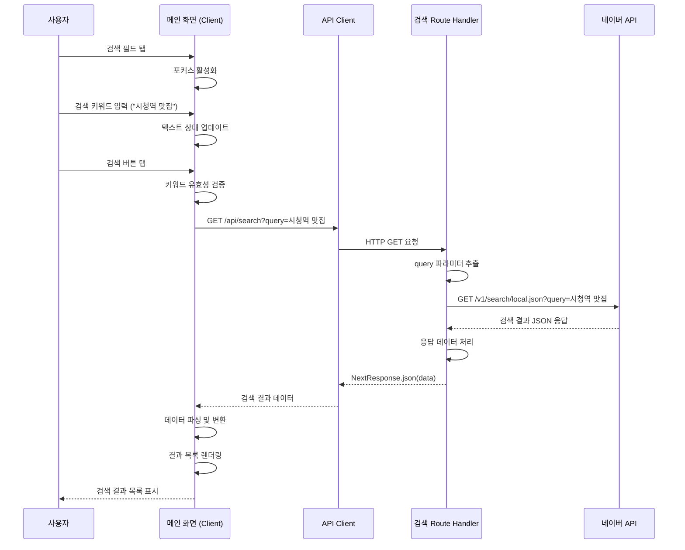

# 유스케이스 작성 템플릿

## 유스케이스 ID: UC-001

### 제목
장소 검색 (Place Search)

---

## 1. 개요

### 1.1 목적
사용자가 메인 화면에서 검색 키워드를 입력하여 네이버 검색 API를 통해 장소 목록을 조회하고, 관심 있는 장소의 위치와 기본 정보를 확인할 수 있도록 하는 것이 목적입니다. 이를 통해 사용자는 지도 기반으로 맛집이나 관심 장소를 빠르게 탐색할 수 있습니다.

### 1.2 범위
- **포함**: 검색어 입력, 네이버 지역 검색 API 호출, 검색 결과 목록 표시, 입력 검증
- **제외**: 검색 결과 상세 정보 조회 (별도 유스케이스), 검색 이력 저장, 자동완성 기능

### 1.3 액터
- **주요 액터**: 사용자 (앱을 사용하는 일반 사용자)
- **부 액터**: 네이버 지역 검색 API (외부 시스템)

---

## 2. 선행 조건

- 사용자가 앱을 실행하여 메인 (지도) 화면에 진입한 상태
- 네이버 API 인증 정보(Client ID, Client Secret)가 환경 변수에 설정되어 있음
- 클라이언트와 서버 간 네트워크 연결이 정상 작동 중

---

## 3. 참여 컴포넌트

- **메인 화면 (Client Component)**: 검색 입력 필드 UI, 검색 버튼, 검색 결과 목록 표시
- **검색 API Route Handler**: 네이버 지역 검색 API 호출을 처리하는 백엔드 엔드포인트 (`app/api/search/route.ts`)
- **네이버 지역 검색 API**: 장소 검색 데이터를 제공하는 외부 REST API
- **API Client**: 프론트엔드에서 백엔드 API를 호출하기 위한 HTTP 클라이언트 (`@/lib/remote/api-client`)

---

## 4. 기본 플로우 (Basic Flow)

### 4.1 단계별 흐름

1. **[사용자]**: 메인 화면의 검색 입력 필드를 탭
   - 입력: 없음 (화면 진입)
   - 처리: 검색 입력 필드에 포커스 활성화
   - 출력: 입력 가능 상태의 검색 필드

2. **[사용자]**: 검색 키워드 입력 (예: "시청역 맛집")
   - 입력: 검색 키워드 텍스트
   - 처리: 입력된 텍스트를 실시간으로 상태에 반영
   - 출력: 입력 필드에 텍스트 표시

3. **[사용자]**: 검색 버튼 또는 키보드의 검색 아이콘 탭
   - 입력: 검색 실행 이벤트
   - 처리: 검색 요청 트리거
   - 출력: 로딩 상태 표시 (스피너 등)

4. **[메인 화면]**: 입력 필드에서 검색 키워드 텍스트 추출
   - 입력: 검색 필드의 현재 값
   - 처리: 텍스트 값 가져오기
   - 출력: 검색 키워드 문자열

5. **[메인 화면]**: 키워드 유효성 검증
   - 입력: 검색 키워드 문자열
   - 처리: 비어 있거나 공백만 있는지 확인
   - 출력: 유효성 검증 결과 (true/false)

6. **[메인 화면]**: API Client를 통해 백엔드 검색 엔드포인트 호출
   - 입력: 검증된 검색 키워드
   - 처리: `GET /api/search?query={키워드}` HTTP 요청 전송
   - 출력: Promise (응답 대기)

7. **[검색 API Route Handler]**: 요청 파라미터에서 query 값 추출
   - 입력: HTTP 요청 객체
   - 처리: `searchParams.get('query')` 실행
   - 출력: query 문자열

8. **[검색 API Route Handler]**: 네이버 지역 검색 API 호출
   - 입력: query 문자열
   - 처리:
     - 네이버 API URL 생성 (`https://openapi.naver.com/v1/search/local.json?query={query}&display=5`)
     - 인증 헤더 설정 (`X-Naver-Client-Id`, `X-Naver-Client-Secret`)
     - `fetch` 함수로 HTTP GET 요청 실행
   - 출력: 네이버 API 응답 데이터

9. **[검색 API Route Handler]**: 응답 데이터 처리
   - 입력: 네이버 API 응답 (JSON)
   - 처리:
     - 응답 상태 코드 확인 (`response.ok`)
     - JSON 파싱 (`response.json()`)
     - Next.js Response 객체로 변환
   - 출력: `NextResponse.json(data)`

10. **[메인 화면]**: 응답 데이터 수신 및 파싱
    - 입력: 백엔드 API 응답 (JSON)
    - 처리:
      - 응답 데이터 구조 검증
      - UI 표시용 데이터 모델로 변환 (이름, 주소, 좌표 등)
    - 출력: 장소 목록 배열

11. **[메인 화면]**: 검색 결과 목록 UI 렌더링
    - 입력: 장소 목록 배열
    - 처리:
      - 각 장소 항목을 리스트 아이템으로 렌더링
      - 장소 이름, 주소 등 기본 정보 표시
    - 출력: 화면에 표시된 검색 결과 목록

### 4.2 시퀀스 다이어그램

---

## 5. 대안 플로우 (Alternative Flows)

### 5.1 대안 플로우 1: 검색어 입력 없이 검색 실행

**시작 조건**: 4.1의 3단계 (검색 버튼 탭) 이후

**단계**:
1. 메인 화면이 검색 키워드를 추출함
2. 키워드가 비어 있거나 공백만 있음을 감지
3. API 요청을 보내지 않고 처리 중단
4. 사용자에게 입력을 유도하는 시각적 피드백 제공 (예: 입력 필드 테두리 색상 변경, "검색어를 입력해주세요" 안내 메시지)

**결과**: 검색이 실행되지 않고, 사용자는 여전히 메인 화면에 머무름. 네트워크 요청 없음.

---

## 6. 예외 플로우 (Exception Flows)

### 6.1 예외 상황 1: 네트워크 오류

**발생 조건**:
- 클라이언트와 백엔드 서버 간 네트워크 연결 실패
- 백엔드와 네이버 API 간 네트워크 연결 실패
- 요청 타임아웃 발생

**처리 방법**:
1. 프론트엔드 또는 백엔드에서 네트워크 예외 감지
2. 로딩 상태 해제
3. 사용자에게 오류 메시지 표시
4. 재시도 버튼 제공 (선택적)

**에러 코드**: `NETWORK_ERROR` (HTTP 상태 코드 없음 또는 500)

**사용자 메시지**: "네트워크 연결에 문제가 발생했습니다. 잠시 후 다시 시도해주세요."

---

### 6.2 예외 상황 2: 검색 결과 없음

**발생 조건**:
- 네이버 API 응답은 성공 (200 OK)이지만, 검색 결과 데이터가 비어 있음
- 입력한 키워드에 매칭되는 장소가 없음

**처리 방법**:
1. 백엔드가 성공 응답으로 빈 결과 목록 반환
2. 프론트엔드가 빈 배열 감지
3. 검색 결과 목록 대신 "결과 없음" UI 표시

**에러 코드**: 없음 (정상적인 응답)

**사용자 메시지**: "'{검색어}'에 대한 검색 결과가 없습니다."

---

### 6.3 예외 상황 3: 네이버 API 호출 실패

**발생 조건**:
- 네이버 API 서버 오류 (5xx)
- 인증 정보 오류 (401 Unauthorized)
- 요청 파라미터 오류 (400 Bad Request)
- API 할당량 초과 (429 Too Many Requests)

**처리 방법**:
1. 백엔드 Route Handler에서 `response.ok === false` 감지
2. 에러 로깅 (`console.error` 또는 로깅 서비스)
3. 프론트엔드에 500 Internal Server Error 응답 반환
4. 프론트엔드에서 일반 오류 처리

**에러 코드**: `API_ERROR` (HTTP 500)

**사용자 메시지**: "장소 검색 중 오류가 발생했습니다. 잠시 후 다시 시도해주세요."

---

### 6.4 예외 상황 4: 필수 환경 변수 누락

**발생 조건**:
- `.env.local` 파일에 `NEXT_PUBLIC_NCP_MAP_CLIENT_ID` 또는 `NCP_MAP_CLIENT_SECRET` 누락
- 환경 변수가 빈 문자열

**처리 방법**:
1. 백엔드 Route Handler에서 환경 변수 확인
2. 누락 시 에러 로깅
3. 500 Internal Server Error 응답 반환

**에러 코드**: `CONFIG_ERROR` (HTTP 500)

**사용자 메시지**: "서비스 설정 오류가 발생했습니다. 관리자에게 문의해주세요."

---

## 7. 후행 조건 (Post-conditions)

### 7.1 성공 시

- **데이터베이스 변경**: 없음 (읽기 전용 작업)
- **시스템 상태**:
  - 메인 화면에 검색 결과 목록이 표시됨
  - 사용자는 목록에서 장소를 선택할 수 있는 상태
  - 검색 입력 필드는 입력된 키워드를 유지
- **외부 시스템**: 네이버 API 호출 횟수 1회 증가 (할당량 차감)

### 7.2 실패 시

- **데이터 롤백**: 해당 없음 (데이터 변경 없음)
- **시스템 상태**:
  - 메인 화면에 오류 메시지 또는 빈 결과 안내 표시
  - 검색 입력 필드는 입력된 키워드를 유지
  - 사용자는 재시도 가능한 상태

---

## 8. 비기능 요구사항

### 8.1 성능
- **응답 시간**: 검색 버튼 클릭 후 결과 표시까지 평균 3초 이내 (네이버 API 응답 시간 + 네트워크 지연 포함)
- **타임아웃**: 네이버 API 호출 타임아웃 10초
- **처리량**: 동시 검색 요청 처리 가능 (Next.js 기본 동시성 지원)

### 8.2 보안
- **인증 정보 보호**:
  - `Client Secret`은 절대 클라이언트에 노출되지 않음 (백엔드에서만 사용)
  - 환경 변수는 `.env.local`에 저장하고 `.gitignore`에 포함
- **입력 검증**:
  - 검색 키워드는 URL 인코딩 처리 (`encodeURI`)
  - SQL Injection 등 보안 위협 없음 (데이터베이스 쿼리 없음)

### 8.3 가용성
- **시스템 가동 시간**: 네이버 API 가용성에 의존 (99.9% SLA 가정)
- **복구 시간**: 네트워크 오류 발생 시 즉시 재시도 가능 (수동 재시도)
- **Fallback**: 네이버 API 장애 시 대체 동작 없음 (오류 메시지만 표시)

---

## 9. UI/UX 요구사항

### 9.1 화면 구성

**메인 화면 (검색 전)**:
- 상단에 검색 입력 필드 (placeholder: "장소를 검색하세요")
- 검색 버튼 또는 돋보기 아이콘
- 중앙에 지도 표시
- 검색 결과 목록 영역 없음

**메인 화면 (검색 중)**:
- 검색 버튼에 로딩 스피너 표시
- 검색 입력 필드는 비활성화 (중복 요청 방지)

**메인 화면 (검색 성공)**:
- 검색 결과 목록이 지도 위에 오버레이 또는 하단 시트로 표시
- 각 항목에는 장소 이름, 주소 표시
- 항목 탭 시 상세 화면으로 이동 (별도 유스케이스)

**메인 화면 (검색 실패/결과 없음)**:
- 오류 메시지 또는 빈 결과 안내 표시
- 검색 입력 필드는 활성화 상태 유지 (재시도 가능)

### 9.2 사용자 경험

- **즉각적인 피드백**: 검색 버튼 탭 시 즉시 로딩 상태 표시
- **명확한 안내**: 오류 발생 시 사용자가 이해하기 쉬운 메시지 제공
- **재시도 용이성**: 오류 시 검색어 유지, 재시도 버튼 제공 (선택적)
- **접근성**:
  - 검색 입력 필드는 키보드 포커스 가능
  - 검색 버튼은 터치 영역 최소 44x44px
  - 스크린 리더 지원 (ARIA 레이블)

---

## 10. 테스트 시나리오

### 10.1 성공 케이스

| 테스트 케이스 ID | 입력값 | 기대 결과 |
|----------------|--------|----------|
| TC-001-01      | "시청역 맛집" | 검색 결과 목록에 시청역 근처 맛집 5개 이하 표시 |
| TC-001-02      | "강남 카페" | 검색 결과 목록에 강남 근처 카페 5개 이하 표시 |
| TC-001-03      | "서울시청" | 검색 결과 목록에 서울시청 관련 장소 표시 |

### 10.2 실패 케이스

| 테스트 케이스 ID | 입력값 | 기대 결과 |
|----------------|--------|----------|
| TC-001-04      | "" (빈 문자열) | "검색어를 입력해주세요" 메시지 표시, API 요청 없음 |
| TC-001-05      | "   " (공백만) | "검색어를 입력해주세요" 메시지 표시, API 요청 없음 |
| TC-001-06      | "zxcvbnmasdfgh12345" (존재하지 않는 장소) | "'{검색어}'에 대한 검색 결과가 없습니다." 메시지 표시 |
| TC-001-07      | 네트워크 연결 끊김 상태에서 검색 | "네트워크 연결에 문제가 발생했습니다. 잠시 후 다시 시도해주세요." 메시지 표시 |
| TC-001-08      | 잘못된 API 인증 정보 설정 상태에서 검색 | "장소 검색 중 오류가 발생했습니다. 잠시 후 다시 시도해주세요." 메시지 표시 (백엔드에서 401 에러 로깅) |

---

## 11. 관련 유스케이스

- **선행 유스케이스**: 없음 (앱 진입 시 첫 번째 기능)
- **후행 유스케이스**:
  - UC-002: 검색 결과 선택 및 상세 정보 조회 (Select Search Result & View Details)
  - UC-003: 리뷰 작성 (Write a Review) - 장소 상세 정보 조회 후 실행 가능
- **연관 유스케이스**:
  - 지도 표시 및 마커 생성 (검색 결과 선택 시 지도에 마커 표시)

---

## 12. 변경 이력

| 버전 | 날짜 | 작성자 | 변경 내용 |
|------|------|--------|-----------|
| 1.0  | 2025-10-23 | Claude | 초기 작성 |

---

## 부록

### A. 용어 정의

- **Client ID**: 네이버 API 인증을 위한 공개 식별자. 클라이언트(브라우저)에 노출 가능.
- **Client Secret**: 네이버 API 인증을 위한 비밀 키. 서버에서만 사용, 절대 클라이언트에 노출 불가.
- **Route Handler**: Next.js에서 백엔드 API 엔드포인트를 정의하는 파일 (`app/api/.../route.ts`).
- **오버레이**: 지도 위에 표시되는 추가 UI 요소 (검색 결과 목록, 마커 등).
- **스낵바/토스트**: 화면 하단에 잠시 표시되는 간단한 피드백 메시지.

### B. 참고 자료

- **네이버 지역 검색 API 문서**: https://developers.naver.com/docs/serviceapi/search/local/local.md
- **Next.js Route Handlers**: https://nextjs.org/docs/app/building-your-application/routing/route-handlers
- **Next.js 환경 변수**: https://nextjs.org/docs/app/building-your-application/configuring/environment-variables
- **프로젝트 PRD**: `/docs/prd.md`
- **프로젝트 유저플로우**: `/docs/userflow.md`
- **네이버 지도 연동 가이드**: `/docs/external/map.md`
