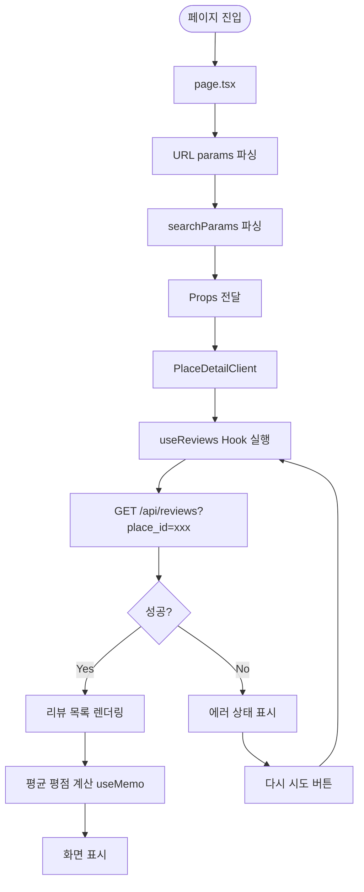

# 장소 상세 정보 화면 구현 계획

**문서 버전**: 1.0
**작성일**: 2025-10-23
**기준 문서**: prd.md, userflow.md, database.md, common-modules.md, usecases/002-select-place-details.md, state.md

---

## 1. 개요

본 문서는 장소 상세 정보 화면(`/place/[id]`)의 구체적인 구현 계획을 정의합니다. 이 화면은 사용자가 검색 결과에서 특정 장소를 선택했을 때 표시되며, 장소 기본 정보와 리뷰 목록을 보여줍니다.

### 1.1 페이지 기본 정보

- **라우트**: `/place/[id]`
- **진입 경로**: 메인 화면의 검색 결과 목록에서 장소 선택 시
- **주요 기능**:
  - 장소 기본 정보 표시 (이름, 주소, 평균 평점)
  - 리뷰 목록 조회 및 표시 (최신순 정렬)
  - 리뷰 작성 화면으로 이동하는 버튼 제공

### 1.2 구현 범위

**포함 사항**:
- Next.js App Router 기반 페이지 구조
- React Query를 활용한 서버 상태 관리
- 공통 모듈에서 구현된 컴포넌트 재사용 (ReviewCard, StarRating, EmptyState)
- 로딩 상태 및 에러 처리
- 리뷰 작성 화면으로의 네비게이션

**제외 사항**:
- 리뷰 작성 기능 (별도 페이지에서 구현)
- 리뷰 수정/삭제 기능
- 리뷰 필터링 및 정렬 기능
- 장소 즐겨찾기 기능

---

## 2. 디렉토리 구조

```
src/
├── app/
│   └── place/
│       └── [id]/
│           ├── page.tsx                    (✨ 새로 생성 - Server Component)
│           └── place-detail-client.tsx     (✨ 새로 생성 - Client Component)
│
├── features/
│   ├── place/
│   │   └── components/
│   │       └── place-header.tsx            (✨ 새로 생성 - 장소 기본 정보 헤더)
│   │
│   └── review/
│       ├── components/
│       │   ├── review-list-container.tsx   (✨ 새로 생성 - 리뷰 목록 컨테이너)
│       │   ├── review-list.tsx             (✨ 새로 생성 - 리뷰 목록)
│       │   └── review-list-skeleton.tsx    (✨ 새로 생성 - 로딩 스켈레톤)
│       │
│       ├── hooks/
│       │   └── use-reviews.ts              (✅ 이미 구현됨)
│       │
│       └── utils/
│           └── calculate-rating.ts         (✨ 새로 생성 - 평균 평점 계산)
│
└── components/
    ├── common/
    │   ├── empty-state.tsx                 (✅ 이미 구현됨)
    │   ├── error-state.tsx                 (✨ 새로 생성 - 에러 상태 표시)
    │   └── floating-action-button.tsx      (✨ 새로 생성 - 플로팅 버튼)
    │
    ├── rating/
    │   └── star-rating.tsx                 (✅ 이미 구현됨)
    │
    └── review/
        └── review-card.tsx                 (✅ 이미 구현됨)
```

**범례**:
- ✨ 새로 생성: 이번 작업에서 새로 구현할 파일
- ✅ 이미 구현됨: 공통 모듈에서 이미 구현된 파일

---

## 3. 페이지 구조 및 데이터 흐름

### 3.1 페이지 컴포넌트 계층 구조

```
page.tsx (Server Component)
└── PlaceDetailClient (Client Component)
    ├── PlaceHeader
    │   ├── 장소명 (h1)
    │   ├── 주소 (p)
    │   └── AverageRating (평균 평점 + 리뷰 개수)
    │       └── StarRating (공통 컴포넌트)
    │
    ├── ReviewListContainer
    │   ├── (isLoading) → ReviewListSkeleton
    │   ├── (isError) → ErrorState
    │   ├── (reviews.length === 0) → EmptyState
    │   └── (reviews) → ReviewList
    │       └── ReviewCard[] (공통 컴포넌트)
    │
    └── FloatingActionButton (리뷰 작성하기)
```

### 3.2 데이터 흐름



---

## 4. 구현할 컴포넌트 상세 설계

### 4.1 Page Component (Server Component)

**파일**: `src/app/place/[id]/page.tsx`

**책임**:
- URL params에서 `id` 추출
- searchParams에서 장소 기본 정보 추출 (name, address, lat, lng)
- Client Component에 Props 전달

**Props 인터페이스**:
```typescript
interface PlaceDetailPageProps {
  params: Promise<{ id: string }>;
  searchParams?: Promise<{
    name?: string;
    address?: string;
    lat?: string;
    lng?: string;
  }>;
}
```

**구현 포인트**:
- Next.js App Router의 async/await params 처리
- searchParams가 없을 경우 기본값 설정 (빈 문자열)
- Suspense 경계 설정 (로딩 처리)

**코드 스켈레톤**:
```typescript
import { Suspense } from 'react';
import PlaceDetailClient from './place-detail-client';

export default async function PlaceDetailPage({ params, searchParams }: PlaceDetailPageProps) {
  const { id: placeId } = await params;
  const search = await searchParams;

  const placeInfo = {
    id: placeId,
    name: search?.name || '',
    address: search?.address || '',
    coordinates: {
      lat: search?.lat ? parseFloat(search.lat) : 0,
      lng: search?.lng ? parseFloat(search.lng) : 0,
    },
  };

  return (
    <Suspense fallback={<div>Loading...</div>}>
      <PlaceDetailClient placeInfo={placeInfo} />
    </Suspense>
  );
}
```

---

### 4.2 PlaceDetailClient (Client Component)

**파일**: `src/app/place/[id]/place-detail-client.tsx`

**책임**:
- React Query를 사용한 리뷰 목록 조회
- 평균 평점 계산 (useMemo)
- 하위 컴포넌트들을 조합하여 전체 화면 구성
- 리뷰 작성 화면으로의 네비게이션 처리

**Props 인터페이스**:
```typescript
interface PlaceDetailClientProps {
  placeInfo: {
    id: string;
    name: string;
    address: string;
    coordinates: {
      lat: number;
      lng: number;
    };
  };
}
```

**상태 관리**:
- `useReviews(placeId)`: 리뷰 목록 조회 (React Query)
- `averageRating`: 평균 평점 (useMemo로 계산)

**구현 포인트**:
- `useReviews` Hook으로 리뷰 데이터 조회
- `useMemo`로 평균 평점 및 리뷰 개수 계산
- `useRouter`로 리뷰 작성 페이지 이동
- 로딩/에러/빈 상태 처리

**코드 스켈레톤**:
```typescript
'use client';

import { useMemo } from 'react';
import { useRouter } from 'next/navigation';
import { useReviews } from '@/features/review/hooks/use-reviews';
import PlaceHeader from '@/features/place/components/place-header';
import ReviewListContainer from '@/features/review/components/review-list-container';
import FloatingActionButton from '@/components/common/floating-action-button';
import { calculateAverageRating } from '@/features/review/utils/calculate-rating';

export default function PlaceDetailClient({ placeInfo }: PlaceDetailClientProps) {
  const router = useRouter();
  const { data: reviews, isLoading, isError, error, refetch } = useReviews(placeInfo.id);

  const { average: averageRating, count: reviewCount } = useMemo(
    () => calculateAverageRating(reviews),
    [reviews]
  );

  const handleWriteReview = () => {
    router.push(`/place/${placeInfo.id}/write-review`);
  };

  return (
    <div className="min-h-screen bg-gray-50">
      <PlaceHeader
        name={placeInfo.name}
        address={placeInfo.address}
        averageRating={averageRating}
        reviewCount={reviewCount}
      />

      <ReviewListContainer
        reviews={reviews}
        isLoading={isLoading}
        isError={isError}
        error={error}
        onRetry={refetch}
      />

      <FloatingActionButton label="리뷰 작성하기" onClick={handleWriteReview} />
    </div>
  );
}
```

---

### 4.3 PlaceHeader (장소 기본 정보 헤더)

**파일**: `src/features/place/components/place-header.tsx`

**책임**:
- 장소명, 주소 표시
- 평균 평점 및 리뷰 개수 표시

**Props 인터페이스**:
```typescript
interface PlaceHeaderProps {
  name: string;
  address: string;
  averageRating: number;
  reviewCount: number;
}
```

**UI 구조**:
```
┌─────────────────────────────────────┐
│ [장소명]                            │
│ [주소]                              │
│ [★★★★☆ 4.2 (리뷰 15개)]            │
└─────────────────────────────────────┘
```

**구현 포인트**:
- 장소명은 `text-3xl font-semibold` (H1 스타일)
- 주소는 `text-sm text-muted-foreground`
- 평균 평점은 `StarRating` 컴포넌트 사용 (readOnly)
- 리뷰 개수는 괄호 안에 표시

**코드 스켈레톤**:
```typescript
'use client';

import StarRating from '@/components/rating/star-rating';
import { MapPin } from 'lucide-react';

export default function PlaceHeader({
  name,
  address,
  averageRating,
  reviewCount
}: PlaceHeaderProps) {
  return (
    <div className="bg-white border-b border-gray-200 px-6 py-8">
      <div className="max-w-7xl mx-auto">
        <h1 className="text-3xl font-semibold text-gray-900 mb-2">{name}</h1>

        <div className="flex items-center gap-2 text-sm text-muted-foreground mb-4">
          <MapPin className="h-4 w-4" />
          <span>{address}</span>
        </div>

        {reviewCount > 0 && (
          <div className="flex items-center gap-2">
            <StarRating value={averageRating} readOnly size="sm" />
            <span className="text-sm text-gray-600">
              {averageRating.toFixed(1)} (리뷰 {reviewCount}개)
            </span>
          </div>
        )}

        {reviewCount === 0 && (
          <p className="text-sm text-gray-500">아직 리뷰가 없습니다</p>
        )}
      </div>
    </div>
  );
}
```

---

### 4.4 ReviewListContainer (리뷰 목록 컨테이너)

**파일**: `src/features/review/components/review-list-container.tsx`

**책임**:
- 로딩/에러/빈 상태 처리
- 리뷰 목록 표시 조건 분기

**Props 인터페이스**:
```typescript
import type { Review } from '@/features/review/backend/schema';

interface ReviewListContainerProps {
  reviews: Review[] | undefined;
  isLoading: boolean;
  isError: boolean;
  error: Error | null;
  onRetry: () => void;
}
```

**조건 분기 로직**:
1. `isLoading === true` → `ReviewListSkeleton` 표시
2. `isError === true` → `ErrorState` 표시
3. `reviews && reviews.length === 0` → `EmptyState` 표시
4. `reviews && reviews.length > 0` → `ReviewList` 표시

**코드 스켈레톤**:
```typescript
'use client';

import ReviewList from './review-list';
import ReviewListSkeleton from './review-list-skeleton';
import EmptyState from '@/components/common/empty-state';
import ErrorState from '@/components/common/error-state';
import { MessageSquare } from 'lucide-react';

export default function ReviewListContainer({
  reviews,
  isLoading,
  isError,
  error,
  onRetry
}: ReviewListContainerProps) {
  if (isLoading) {
    return <ReviewListSkeleton />;
  }

  if (isError) {
    return (
      <ErrorState
        message={error?.message || '리뷰를 불러오는 중 오류가 발생했습니다.'}
        onRetry={onRetry}
      />
    );
  }

  if (reviews && reviews.length === 0) {
    return (
      <div className="px-6 py-8">
        <EmptyState
          icon={<MessageSquare className="h-12 w-12 text-muted-foreground" />}
          title="아직 리뷰가 없습니다"
          description="이 장소에 대한 첫 번째 리뷰를 작성해보세요!"
        />
      </div>
    );
  }

  return <ReviewList reviews={reviews || []} />;
}
```

---

### 4.5 ReviewList (리뷰 목록)

**파일**: `src/features/review/components/review-list.tsx`

**책임**:
- 리뷰 목록을 순회하며 `ReviewCard` 렌더링
- 최신순 정렬

**Props 인터페이스**:
```typescript
import type { Review } from '@/features/review/backend/schema';

interface ReviewListProps {
  reviews: Review[];
}
```

**구현 포인트**:
- `ReviewCard` 컴포넌트 재사용 (이미 구현됨)
- `gap-4`로 카드 간격 설정
- 리뷰가 이미 최신순으로 정렬되어 있다고 가정 (백엔드에서 `ORDER BY created_at DESC`)

**코드 스켈레톤**:
```typescript
'use client';

import ReviewCard from '@/components/review/review-card';
import type { Review } from '@/features/review/backend/schema';

export default function ReviewList({ reviews }: ReviewListProps) {
  return (
    <div className="max-w-7xl mx-auto px-6 py-8">
      <h2 className="text-xl font-semibold mb-4">리뷰 ({reviews.length}개)</h2>
      <div className="space-y-4">
        {reviews.map((review) => (
          <ReviewCard key={review.id} review={review} />
        ))}
      </div>
    </div>
  );
}
```

---

### 4.6 ReviewListSkeleton (로딩 스켈레톤)

**파일**: `src/features/review/components/review-list-skeleton.tsx`

**책임**:
- 리뷰 목록 로딩 중 스켈레톤 UI 표시

**구현 포인트**:
- 3개의 스켈레톤 카드 표시
- Tailwind의 `animate-pulse` 사용
- 실제 ReviewCard와 유사한 구조

**코드 스켈레톤**:
```typescript
'use client';

import { Card, CardHeader, CardContent } from '@/components/ui/card';

export default function ReviewListSkeleton() {
  return (
    <div className="max-w-7xl mx-auto px-6 py-8">
      <div className="h-6 bg-gray-300 rounded w-1/4 mb-4 animate-pulse" />
      <div className="space-y-4">
        {[1, 2, 3].map((i) => (
          <Card key={i}>
            <CardHeader className="pb-3">
              <div className="flex items-center justify-between">
                <div className="flex-1">
                  <div className="h-5 bg-gray-300 rounded w-1/3 mb-2 animate-pulse" />
                  <div className="h-4 bg-gray-200 rounded w-1/4 animate-pulse" />
                </div>
                <div className="flex gap-1">
                  {[1, 2, 3, 4, 5].map((star) => (
                    <div key={star} className="h-4 w-4 bg-gray-300 rounded-full animate-pulse" />
                  ))}
                </div>
              </div>
            </CardHeader>
            <CardContent>
              <div className="space-y-2">
                <div className="h-4 bg-gray-200 rounded w-full animate-pulse" />
                <div className="h-4 bg-gray-200 rounded w-5/6 animate-pulse" />
                <div className="h-4 bg-gray-200 rounded w-4/6 animate-pulse" />
              </div>
            </CardContent>
          </Card>
        ))}
      </div>
    </div>
  );
}
```

---

### 4.7 ErrorState (에러 상태 표시)

**파일**: `src/components/common/error-state.tsx`

**책임**:
- 에러 메시지 표시
- 재시도 버튼 제공

**Props 인터페이스**:
```typescript
interface ErrorStateProps {
  message: string;
  onRetry: () => void;
}
```

**UI 구조**:
```
┌─────────────────────────────────────┐
│         [에러 아이콘]               │
│    리뷰를 불러오는 중 오류가...     │
│      [다시 시도 버튼]               │
└─────────────────────────────────────┘
```

**코드 스켈레톤**:
```typescript
'use client';

import { AlertCircle } from 'lucide-react';
import { Button } from '@/components/ui/button';

export default function ErrorState({ message, onRetry }: ErrorStateProps) {
  return (
    <div className="flex flex-col items-center justify-center py-12 text-center px-6">
      <AlertCircle className="h-12 w-12 text-red-500 mb-4" />
      <h3 className="text-lg font-semibold text-gray-900 mb-2">오류 발생</h3>
      <p className="text-sm text-muted-foreground max-w-md mb-6">{message}</p>
      <Button onClick={onRetry} variant="outline">
        다시 시도
      </Button>
    </div>
  );
}
```

---

### 4.8 FloatingActionButton (플로팅 액션 버튼)

**파일**: `src/components/common/floating-action-button.tsx`

**책임**:
- 화면 우하단 고정 버튼
- 리뷰 작성 화면으로 이동

**Props 인터페이스**:
```typescript
interface FloatingActionButtonProps {
  label: string;
  onClick: () => void;
}
```

**UI 구조**:
```
화면 우하단 고정 버튼
(모바일: 화면 하단 중앙)
```

**구현 포인트**:
- `fixed bottom-6 right-6` 포지셔닝
- 모바일: `fixed bottom-6 left-1/2 -translate-x-1/2`
- 그림자 효과: `shadow-lg`
- hover 효과: `hover:shadow-xl hover:scale-105`

**코드 스켈레톤**:
```typescript
'use client';

import { Button } from '@/components/ui/button';
import { Plus } from 'lucide-react';

export default function FloatingActionButton({ label, onClick }: FloatingActionButtonProps) {
  return (
    <Button
      onClick={onClick}
      size="lg"
      className="fixed bottom-6 right-6 shadow-lg hover:shadow-xl hover:scale-105 transition-all duration-200 md:bottom-8 md:right-8"
    >
      <Plus className="h-5 w-5 mr-2" />
      {label}
    </Button>
  );
}
```

---

### 4.9 calculateAverageRating (평균 평점 계산 유틸리티)

**파일**: `src/features/review/utils/calculate-rating.ts`

**책임**:
- 리뷰 목록에서 평균 평점과 리뷰 개수 계산

**함수 인터페이스**:
```typescript
import type { Review } from '../backend/schema';

interface AverageRatingData {
  average: number; // 평균 평점 (소수점 1자리)
  count: number;   // 총 리뷰 개수
}

export function calculateAverageRating(reviews: Review[] | undefined): AverageRatingData
```

**구현 로직**:
1. `reviews`가 `undefined`이거나 빈 배열이면 `{ average: 0, count: 0 }` 반환
2. 모든 리뷰의 `rating` 합산
3. 평균 계산 후 소수점 1자리로 반올림
4. `{ average, count }` 반환

**코드 스켈레톤**:
```typescript
import type { Review } from '../backend/schema';

export interface AverageRatingData {
  average: number;
  count: number;
}

export function calculateAverageRating(reviews: Review[] | undefined): AverageRatingData {
  if (!reviews || reviews.length === 0) {
    return { average: 0, count: 0 };
  }

  const sum = reviews.reduce((acc, review) => acc + review.rating, 0);
  const average = Math.round((sum / reviews.length) * 10) / 10;

  return { average, count: reviews.length };
}
```

---

## 5. 에러 처리 및 엣지 케이스

### 5.1 URL 파라미터 누락

**상황**: `place_id`가 URL에 없거나 빈 문자열인 경우

**처리 방법**:
- `useReviews` Hook의 `enabled` 옵션으로 `place_id`가 없으면 쿼리 실행 안 함
- 화면에 "장소 정보를 불러올 수 없습니다" 메시지 표시

### 5.2 네트워크 오류

**상황**: API 요청 실패 (타임아웃, 연결 끊김, 5xx 에러)

**처리 방법**:
- React Query의 자동 재시도 (기본 3회)
- `ErrorState` 컴포넌트로 에러 메시지 및 "다시 시도" 버튼 표시
- 사용자가 "다시 시도" 버튼 클릭 시 `refetch()` 호출

### 5.3 빈 리뷰 목록

**상황**: 리뷰가 하나도 없는 장소

**처리 방법**:
- `EmptyState` 컴포넌트 표시
- "아직 리뷰가 없습니다. 첫 번째 리뷰를 작성해보세요!" 메시지
- "리뷰 작성하기" 버튼 강조

### 5.4 평균 평점 계산 오류

**상황**: `reviews` 배열에 유효하지 않은 데이터가 있는 경우

**처리 방법**:
- `calculateAverageRating` 함수에서 방어적 코딩
- 유효하지 않은 `rating` 값은 계산에서 제외
- 최악의 경우 평균 평점 0으로 표시

---

## 6. 성능 최적화

### 6.1 메모이제이션

- **평균 평점 계산**: `useMemo`로 래핑하여 `reviews` 배열이 변경될 때만 재계산
- **리뷰 목록 정렬**: 백엔드에서 이미 정렬된 데이터 전달 (클라이언트 측 정렬 불필요)

### 6.2 React Query 캐싱

- **staleTime**: 5분 (5 * 60 * 1000)
- **gcTime**: 10분 (10 * 60 * 1000)
- 같은 장소를 재방문 시 캐시된 데이터 즉시 표시

### 6.3 컴포넌트 분리

- 장소 기본 정보와 리뷰 목록을 별도 컴포넌트로 분리
- 리뷰 목록 업데이트 시 장소 헤더는 재렌더링 안 됨

---

## 7. 접근성 (Accessibility)

### 7.1 시맨틱 HTML

- 장소명: `<h1>` 태그 사용
- 주소: `<p>` 태그 사용
- 리뷰 목록: `<div>` 대신 의미 있는 구조 사용

### 7.2 키보드 내비게이션

- "리뷰 작성하기" 버튼: 키보드로 포커스 가능
- "다시 시도" 버튼: 키보드로 포커스 가능
- Tab 키로 모든 인터랙티브 요소 접근 가능

### 7.3 스크린 리더 지원

- 평균 평점: "평균 평점 4.2점, 리뷰 15개" 형식으로 읽힘
- 빈 상태: "아직 리뷰가 없습니다. 첫 번째 리뷰를 작성해보세요!"
- 에러 상태: "오류 발생. 리뷰를 불러오는 중 오류가 발생했습니다. 다시 시도 버튼"

---

## 8. 테스트 시나리오

### 8.1 정상 흐름

| 테스트 케이스 | 입력 | 기대 결과 |
|--------------|------|----------|
| TC-001 | 리뷰가 있는 장소 ID 전달 | 장소 정보 및 리뷰 목록 표시, 평균 평점 계산 |
| TC-002 | 리뷰가 없는 장소 ID 전달 | "아직 리뷰가 없습니다" EmptyState 표시 |
| TC-003 | "리뷰 작성하기" 버튼 클릭 | `/place/[id]/write-review` 페이지로 이동 |

### 8.2 에러 흐름

| 테스트 케이스 | 입력 | 기대 결과 |
|--------------|------|----------|
| TC-004 | 네트워크 오류 발생 | ErrorState 표시, "다시 시도" 버튼 제공 |
| TC-005 | "다시 시도" 버튼 클릭 | API 재요청 |
| TC-006 | 유효하지 않은 place_id | ErrorState 표시 또는 EmptyState 표시 |

### 8.3 성능 테스트

| 테스트 케이스 | 입력 | 기대 결과 |
|--------------|------|----------|
| TC-007 | 리뷰 100개 조회 | 2초 이내 렌더링 완료 |
| TC-008 | 같은 장소 재방문 | 캐시된 데이터 즉시 표시 (로딩 없음) |

---

## 9. 구현 순서

### Phase 1: 유틸리티 및 타입 정의
1. `src/features/review/utils/calculate-rating.ts` 구현
2. 타입 정의 확인 (이미 `state.md`에서 정의됨)

### Phase 2: 공통 컴포넌트
1. `src/components/common/error-state.tsx` 구현
2. `src/components/common/floating-action-button.tsx` 구현

### Phase 3: 리뷰 관련 컴포넌트
1. `src/features/review/components/review-list-skeleton.tsx` 구현
2. `src/features/review/components/review-list.tsx` 구현
3. `src/features/review/components/review-list-container.tsx` 구현

### Phase 4: 장소 관련 컴포넌트
1. `src/features/place/components/place-header.tsx` 구현

### Phase 5: 페이지 컴포넌트
1. `src/app/place/[id]/place-detail-client.tsx` 구현
2. `src/app/place/[id]/page.tsx` 구현

### Phase 6: 테스트 및 검증
1. 로딩 상태 확인
2. 에러 상태 확인 (네트워크 차단 후 테스트)
3. 빈 상태 확인 (리뷰 없는 장소)
4. 정상 상태 확인 (리뷰 있는 장소)
5. 평균 평점 계산 검증
6. 리뷰 작성 화면 이동 확인

---

## 10. 체크리스트

### 기능 구현
- [ ] `calculateAverageRating` 유틸리티 함수 구현
- [ ] `ErrorState` 컴포넌트 구현
- [ ] `FloatingActionButton` 컴포넌트 구현
- [ ] `ReviewListSkeleton` 컴포넌트 구현
- [ ] `ReviewList` 컴포넌트 구현
- [ ] `ReviewListContainer` 컴포넌트 구현
- [ ] `PlaceHeader` 컴포넌트 구현
- [ ] `PlaceDetailClient` 컴포넌트 구현
- [ ] `page.tsx` 서버 컴포넌트 구현

### 에러 처리
- [ ] 네트워크 오류 처리
- [ ] 빈 리뷰 목록 처리
- [ ] 유효하지 않은 place_id 처리

### 성능 최적화
- [ ] `useMemo`로 평균 평점 계산 최적화
- [ ] React Query 캐싱 설정 확인

### 접근성
- [ ] 시맨틱 HTML 사용 확인
- [ ] 키보드 내비게이션 테스트
- [ ] 스크린 리더 지원 확인

### 테스트
- [ ] 정상 흐름 테스트 (TC-001, TC-002, TC-003)
- [ ] 에러 흐름 테스트 (TC-004, TC-005, TC-006)
- [ ] 성능 테스트 (TC-007, TC-008)

---

## 11. 참고 문서

- [PRD 문서](../../prd.md)
- [유저플로우 문서](../../userflow.md)
- [데이터베이스 문서](../../database.md)
- [공통 모듈 문서](../../common-modules.md)
- [UC-002: 검색 결과 선택 및 상세 정보 조회](../../usecases/002-select-place-details.md)
- [상태관리 설계 문서](./state.md)

---

**문서 버전**: 1.0
**최종 수정일**: 2025-10-23
**작성자**: Claude Code
