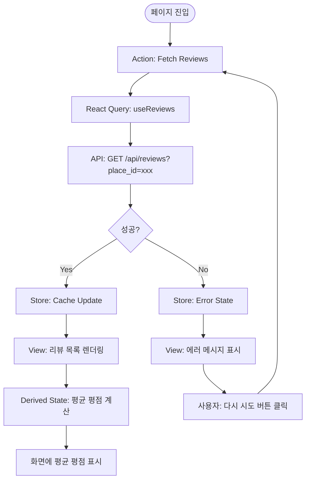
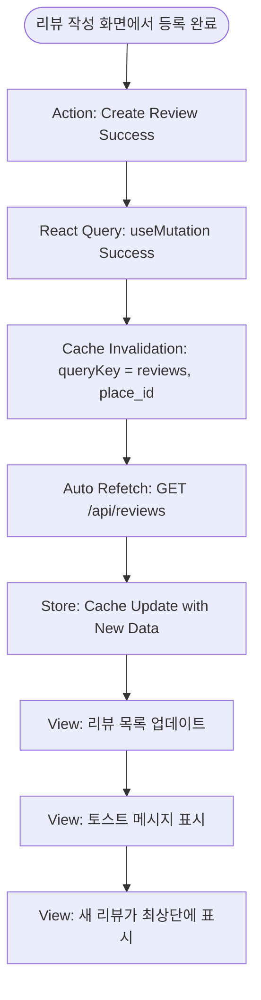
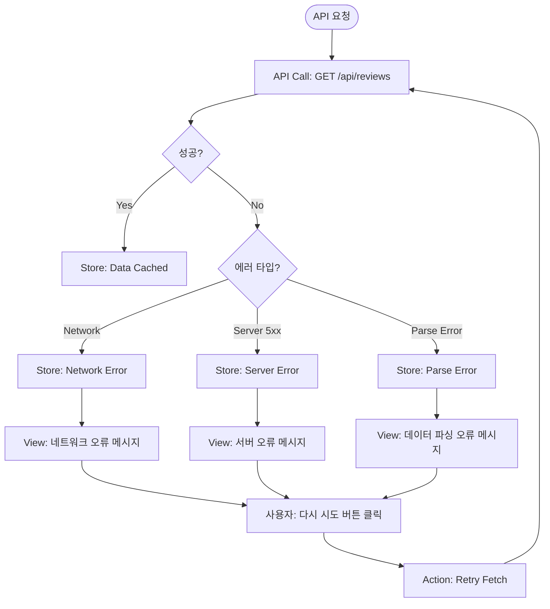

# 장소 상세 정보 화면 상태관리 설계

**문서 버전**: 1.0
**작성일**: 2025-10-23
**기준 문서**: prd.md, userflow.md, database.md, common-modules.md, usecases/002-select-place-details.md, usecases/write-review.md

---

## 1. 개요

본 문서는 장소 상세 정보 화면(`/place/[id]`)의 상태 관리 설계를 다룹니다. Context + useReducer를 사용하지 않고, React Query와 Zustand를 활용하여 서버 상태와 클라이언트 상태를 명확히 분리합니다.

### 1.1 페이지 기본 정보

- **라우트**: `/place/[id]` (Next.js App Router 기준)
- **진입점**: 메인 화면의 검색 결과 목록에서 장소 선택 시
- **주요 기능**:
  - 장소 기본 정보 표시 (이름, 주소, 평균 평점)
  - 리뷰 목록 조회 및 표시 (최신순 정렬)
  - 리뷰 작성 화면으로 이동

### 1.2 상태 관리 전략

- **서버 상태**: React Query로 관리 (리뷰 목록, 평균 평점 등)
- **클라이언트 상태**: Zustand로 관리 (UI 상태, 임시 데이터 등)
- **URL 상태**: Next.js의 `params`, `searchParams`로 관리 (장소 ID)

---

## 2. 관리할 상태 데이터 목록

### 2.1 서버 상태 (React Query)

장소 상세 정보 화면에서 관리하는 서버 상태는 다음과 같습니다:

| 상태명 | 타입 | 설명 | 데이터 소스 |
|--------|------|------|------------|
| **리뷰 목록** | `Review[]` | 해당 장소의 모든 리뷰 | `GET /api/reviews?place_id={id}` |
| **평균 평점** | `number` | 리뷰들의 평균 평점 | 클라이언트 측 계산 (리뷰 목록 기반) |
| **리뷰 개수** | `number` | 총 리뷰 개수 | 클라이언트 측 계산 (리뷰 목록 기반) |

**상태 특성**:
- **캐싱**: React Query 자동 캐싱 (기본 5분)
- **재검증**: 화면 재진입 시 백그라운드에서 자동 재검증
- **무효화 트리거**: 새 리뷰 작성 완료 시

### 2.2 클라이언트 상태 (Zustand)

현재 페이지에서는 복잡한 클라이언트 상태가 필요하지 않으나, 향후 확장을 고려하여 다음과 같이 정의합니다:

| 상태명 | 타입 | 설명 | 초기값 | 사용 위치 |
|--------|------|------|--------|----------|
| **선택된 필터** | `ReviewFilter` | 리뷰 정렬 기준 (최신순, 평점순 등) | `'latest'` | 리뷰 목록 정렬 |
| **스크롤 위치** | `number` | 페이지 이탈 시 스크롤 위치 저장 | `0` | 뒤로가기 시 복원 |

> **참고**: 현재 PRD 범위에서는 리뷰 필터링 기능이 제외되어 있으므로, `ReviewFilter`는 미래 확장을 위한 선언입니다.

### 2.3 URL 상태 (Next.js Params)

| 상태명 | 타입 | 설명 | 위치 |
|--------|------|------|------|
| **장소 ID** | `string` | 현재 조회 중인 장소의 고유 ID | `params.id` |

### 2.4 로컬 컴포넌트 상태 (useState)

React Query와 Zustand로 해결할 수 없는 UI 전용 상태:

| 상태명 | 타입 | 설명 | 컴포넌트 |
|--------|------|------|----------|
| **이미지 모달 열림 상태** | `boolean` | 리뷰 이미지 클릭 시 모달 표시 여부 | `ReviewCard` |
| **더보기 펼침 상태** | `boolean` | 긴 리뷰 내용 더보기 버튼 상태 | `ReviewCard` |

---

## 3. 화면에 보이는 데이터 중 상태가 아닌 것

다음 데이터들은 화면에 표시되지만 **상태로 관리하지 않습니다**:

| 데이터 | 타입 | 설명 | 계산 방식 |
|--------|------|------|----------|
| **장소명** | `string` | 네비게이션 파라미터로 전달받음 | URL 전달 또는 Props |
| **장소 주소** | `string` | 네비게이션 파라미터로 전달받음 | URL 전달 또는 Props |
| **장소 좌표** | `{lat: number, lng: number}` | 네비게이션 파라미터로 전달받음 | URL 전달 또는 Props |
| **평균 평점** | `number` | 리뷰 목록에서 실시간 계산 | `useMemo`로 계산 |
| **리뷰 개수** | `number` | 리뷰 목록의 길이 | `reviews.length` |
| **리뷰가 없는 상태** | `boolean` | 리뷰 목록이 빈 배열인지 확인 | `reviews.length === 0` |
| **로딩 상태** | `boolean` | React Query의 `isLoading` 활용 | React Query 내장 |
| **에러 상태** | `boolean` | React Query의 `isError` 활용 | React Query 내장 |

**설계 원칙**: 파생 가능한 데이터는 상태로 저장하지 않고 계산합니다. (DRY 원칙)

---

## 4. 상태 변경 조건 및 화면 변화

### 4.1 리뷰 목록 상태 변경

| 변경 조건 | 이전 상태 | 새 상태 | 화면 변화 | 트리거 |
|----------|----------|---------|----------|--------|
| **초기 로드 성공** | `undefined` | `Review[]` (데이터 있음) | 리뷰 목록 표시, 평균 평점 계산 | 페이지 진입 |
| **초기 로드 (데이터 없음)** | `undefined` | `[]` | "아직 리뷰가 없습니다" 메시지 표시, "리뷰 작성하기" 버튼 강조 | 페이지 진입 |
| **새 리뷰 작성 후** | `Review[]` (n개) | `Review[]` (n+1개) | 새 리뷰가 목록 최상단에 추가, 평균 평점 업데이트, 토스트 메시지 표시 | 리뷰 작성 성공 |
| **네트워크 오류** | `undefined` | `Error` | 오류 메시지 표시, "다시 시도" 버튼 제공 | API 요청 실패 |
| **새로고침** | `Review[]` (캐시 데이터) | `Review[]` (최신 데이터) | 목록이 최신 데이터로 업데이트 (변경 사항이 있을 경우) | 사용자 Pull-to-Refresh 또는 자동 재검증 |

### 4.2 로딩 상태 변경

| 변경 조건 | 이전 상태 | 새 상태 | 화면 변화 |
|----------|----------|---------|----------|
| **API 요청 시작** | `false` | `true` | 스켈레톤 UI 또는 스피너 표시 |
| **API 요청 완료 (성공)** | `true` | `false` | 실제 데이터 표시 |
| **API 요청 완료 (실패)** | `true` | `false` | 에러 메시지 표시 |

### 4.3 에러 상태 변경

| 변경 조건 | 이전 상태 | 새 상태 | 화면 변화 |
|----------|----------|---------|----------|
| **네트워크 오류 발생** | `null` | `Error` | "리뷰를 불러오는 중 오류가 발생했습니다." 메시지 표시, "다시 시도" 버튼 |
| **재시도 성공** | `Error` | `null` | 정상 데이터 표시 |
| **서버 5xx 오류** | `null` | `Error` | "서버 오류가 발생했습니다." 메시지 표시 |

---

## 5. 상태 플로우 다이어그램 (Flux 패턴)

### 5.1 리뷰 목록 조회 플로우



### 5.2 새 리뷰 작성 후 목록 갱신 플로우



### 5.3 에러 발생 및 재시도 플로우



---

## 6. React Query 설계

### 6.1 Query Key 전략

```typescript
// Query Key 구조
const reviewQueryKeys = {
  all: ['reviews'] as const,
  byPlace: (placeId: string) => ['reviews', placeId] as const,
  detail: (reviewId: number) => ['reviews', 'detail', reviewId] as const,
};
```

### 6.2 useReviews Hook 설계

**파일**: `src/features/review/hooks/use-reviews.ts`

```typescript
import { useQuery } from '@tanstack/react-query';
import { getReviewsByPlaceId } from '../lib/api';
import type { Review } from '../backend/schema';

interface UseReviewsOptions {
  placeId: string;
  enabled?: boolean; // 조건부 쿼리 활성화
}

interface UseReviewsReturn {
  reviews: Review[] | undefined;
  isLoading: boolean;
  isError: boolean;
  error: Error | null;
  refetch: () => void;
}

export function useReviews({ placeId, enabled = true }: UseReviewsOptions): UseReviewsReturn {
  const { data, isLoading, isError, error, refetch } = useQuery({
    queryKey: ['reviews', placeId],
    queryFn: () => getReviewsByPlaceId(placeId),
    enabled: enabled && !!placeId, // placeId가 있을 때만 실행
    staleTime: 5 * 60 * 1000, // 5분간 캐시 유지
    gcTime: 10 * 60 * 1000, // 10분 후 가비지 컬렉션
    retry: 3, // 최대 3회 재시도
    retryDelay: (attemptIndex) => Math.min(1000 * 2 ** attemptIndex, 30000), // Exponential backoff
  });

  return {
    reviews: data,
    isLoading,
    isError,
    error: error as Error | null,
    refetch,
  };
}
```

### 6.3 useCreateReview Hook 설계 (캐시 무효화)

**파일**: `src/features/review/hooks/use-create-review.ts`

```typescript
import { useMutation, useQueryClient } from '@tanstack/react-query';
import { createReview } from '../lib/api';
import type { CreateReviewInput, Review } from '../backend/schema';

interface UseCreateReviewReturn {
  createReview: (input: CreateReviewInput) => Promise<Review>;
  isLoading: boolean;
  isError: boolean;
  error: Error | null;
}

export function useCreateReview(): UseCreateReviewReturn {
  const queryClient = useQueryClient();

  const mutation = useMutation({
    mutationFn: createReview,
    onSuccess: (newReview) => {
      // 해당 장소의 리뷰 목록 캐시 무효화 -> 자동 재조회
      queryClient.invalidateQueries({
        queryKey: ['reviews', newReview.place_id],
      });

      // (선택적) 낙관적 업데이트
      // queryClient.setQueryData(['reviews', newReview.place_id], (old: Review[]) => [newReview, ...old]);
    },
    onError: (error) => {
      console.error('리뷰 생성 실패:', error);
    },
  });

  return {
    createReview: mutation.mutateAsync,
    isLoading: mutation.isPending,
    isError: mutation.isError,
    error: mutation.error as Error | null,
  };
}
```

---

## 7. Zustand 설계 (클라이언트 상태)

### 7.1 Store 구조

**파일**: `src/features/review/store/review-ui-store.ts`

```typescript
import { create } from 'zustand';
import { devtools } from 'zustand/middleware';

interface ReviewUIState {
  // 상태
  filterBy: 'latest' | 'rating' | 'oldest'; // 정렬 기준 (현재 범위 밖, 미래 확장용)
  scrollPosition: number; // 스크롤 위치 저장

  // 액션
  setFilterBy: (filter: 'latest' | 'rating' | 'oldest') => void;
  setScrollPosition: (position: number) => void;
  resetState: () => void; // 상태 초기화
}

export const useReviewUIStore = create<ReviewUIState>()(
  devtools(
    (set) => ({
      // 초기 상태
      filterBy: 'latest',
      scrollPosition: 0,

      // 액션
      setFilterBy: (filter) => set({ filterBy: filter }),
      setScrollPosition: (position) => set({ scrollPosition: position }),
      resetState: () => set({ filterBy: 'latest', scrollPosition: 0 }),
    }),
    { name: 'ReviewUIStore' }
  )
);
```

### 7.2 사용 예시

```typescript
// 컴포넌트에서 사용
function PlaceDetailPage() {
  const { filterBy, setFilterBy } = useReviewUIStore();

  // ...
}
```

---

## 8. 페이지 컴포넌트 구조

### 8.1 컴포넌트 계층 구조

```
app/place/[id]/page.tsx (Server Component)
└── PlaceDetailClient (Client Component)
    ├── PlaceHeader (장소 기본 정보)
    │   ├── PlaceName
    │   ├── PlaceAddress
    │   └── AverageRating (평균 평점 - useMemo로 계산)
    ├── ReviewListContainer (리뷰 목록 컨테이너)
    │   ├── LoadingState (스켈레톤 UI)
    │   ├── ErrorState (에러 메시지 + 재시도 버튼)
    │   ├── EmptyState (리뷰 없음 메시지)
    │   └── ReviewList (리뷰 목록)
    │       └── ReviewCard[] (개별 리뷰 카드)
    └── FloatingActionButton (리뷰 작성 버튼)
```

### 8.2 페이지 컴포넌트 예시

**파일**: `src/app/place/[id]/page.tsx`

```typescript
import { Suspense } from 'react';
import PlaceDetailClient from './place-detail-client';

interface PlaceDetailPageProps {
  params: Promise<{ id: string }>;
  searchParams?: Promise<{
    name?: string;
    address?: string;
    lat?: string;
    lng?: string;
  }>;
}

export default async function PlaceDetailPage({ params, searchParams }: PlaceDetailPageProps) {
  const { id: placeId } = await params;
  const search = await searchParams;

  // URL에서 전달받은 장소 기본 정보
  const placeInfo = {
    id: placeId,
    name: search?.name || '',
    address: search?.address || '',
    coordinates: {
      lat: search?.lat ? parseFloat(search.lat) : 0,
      lng: search?.lng ? parseFloat(search.lng) : 0,
    },
  };

  return (
    <Suspense fallback={<div>Loading...</div>}>
      <PlaceDetailClient placeInfo={placeInfo} />
    </Suspense>
  );
}
```

**파일**: `src/app/place/[id]/place-detail-client.tsx`

```typescript
'use client';

import { useMemo } from 'react';
import { useRouter } from 'next/navigation';
import { useReviews } from '@/features/review/hooks/use-reviews';
import { useReviewUIStore } from '@/features/review/store/review-ui-store';
import PlaceHeader from '@/features/place/components/place-header';
import ReviewListContainer from '@/features/review/components/review-list-container';
import FloatingActionButton from '@/components/common/floating-action-button';
import type { Place } from '@/types/place';

interface PlaceDetailClientProps {
  placeInfo: Place;
}

export default function PlaceDetailClient({ placeInfo }: PlaceDetailClientProps) {
  const router = useRouter();
  const { reviews, isLoading, isError, error, refetch } = useReviews({ placeId: placeInfo.id });
  const { resetState } = useReviewUIStore();

  // 평균 평점 계산 (파생 상태)
  const averageRating = useMemo(() => {
    if (!reviews || reviews.length === 0) return 0;
    const sum = reviews.reduce((acc, review) => acc + review.rating, 0);
    return Math.round((sum / reviews.length) * 10) / 10; // 소수점 1자리
  }, [reviews]);

  // 리뷰 작성 화면으로 이동
  const handleWriteReview = () => {
    router.push(`/place/${placeInfo.id}/write-review`);
  };

  // 컴포넌트 언마운트 시 상태 초기화
  useEffect(() => {
    return () => {
      resetState();
    };
  }, [resetState]);

  return (
    <div className="min-h-screen bg-gray-50">
      {/* 장소 기본 정보 */}
      <PlaceHeader
        name={placeInfo.name}
        address={placeInfo.address}
        averageRating={averageRating}
        reviewCount={reviews?.length || 0}
      />

      {/* 리뷰 목록 */}
      <ReviewListContainer
        reviews={reviews}
        isLoading={isLoading}
        isError={isError}
        error={error}
        onRetry={refetch}
      />

      {/* 리뷰 작성 버튼 (플로팅) */}
      <FloatingActionButton
        label="리뷰 작성하기"
        onClick={handleWriteReview}
      />
    </div>
  );
}
```

---

## 9. 에러 상태 및 로딩 상태 관리

### 9.1 로딩 상태 처리

**전략**: React Query의 `isLoading` 상태를 활용하여 스켈레톤 UI 표시

```typescript
// ReviewListContainer 컴포넌트 내부
if (isLoading) {
  return <ReviewListSkeleton />;
}
```

**스켈레톤 UI 컴포넌트**:
```typescript
function ReviewListSkeleton() {
  return (
    <div className="space-y-4 p-4">
      {[1, 2, 3].map((i) => (
        <div key={i} className="animate-pulse">
          <div className="h-6 bg-gray-300 rounded w-1/3 mb-2" />
          <div className="h-4 bg-gray-200 rounded w-full mb-1" />
          <div className="h-4 bg-gray-200 rounded w-5/6" />
        </div>
      ))}
    </div>
  );
}
```

### 9.2 에러 상태 처리

**전략**: React Query의 `isError`와 `error` 객체를 활용하여 에러 메시지 표시

```typescript
// ReviewListContainer 컴포넌트 내부
if (isError) {
  return (
    <ErrorState
      message={getErrorMessage(error)}
      onRetry={onRetry}
    />
  );
}
```

**에러 메시지 유틸리티**:
```typescript
function getErrorMessage(error: Error | null): string {
  if (!error) return '알 수 없는 오류가 발생했습니다.';

  // 네트워크 오류
  if (error.message.includes('network') || error.message.includes('fetch')) {
    return '네트워크 연결을 확인하고 다시 시도해주세요.';
  }

  // 서버 오류
  if (error.message.includes('500')) {
    return '서버 오류가 발생했습니다. 잠시 후 다시 시도해주세요.';
  }

  // 파싱 오류
  if (error.message.includes('parse') || error.message.includes('JSON')) {
    return '데이터 형식이 올바르지 않습니다.';
  }

  return error.message;
}
```

### 9.3 빈 상태 처리

```typescript
// ReviewListContainer 컴포넌트 내부
if (reviews && reviews.length === 0) {
  return (
    <EmptyState
      icon={<MessageSquare className="h-12 w-12 text-gray-400" />}
      title="아직 리뷰가 없습니다"
      description="이 장소에 대한 첫 번째 리뷰를 작성해보세요!"
    />
  );
}
```

---

## 10. 상태 업데이트 시나리오

### 10.1 시나리오 1: 페이지 진입 (리뷰 있음)

**흐름**:
1. 사용자가 검색 결과에서 장소 선택
2. 메인 화면 → 장소 상세 정보 화면 (`/place/[id]`) 네비게이션
3. `useReviews` Hook 자동 실행 (`enabled: true`)
4. React Query가 `GET /api/reviews?place_id={id}` 요청
5. API 응답 성공 → 캐시에 데이터 저장
6. `reviews` 상태가 `undefined` → `Review[]`로 변경
7. `ReviewList` 컴포넌트가 리뷰 목록 렌더링
8. `useMemo`로 평균 평점 계산 → `PlaceHeader`에 표시

### 10.2 시나리오 2: 페이지 진입 (리뷰 없음)

**흐름**:
1. 1~5번 동일
2. API 응답 성공 → 빈 배열 `[]` 반환
3. `reviews` 상태가 `undefined` → `[]`로 변경
4. `ReviewListContainer`에서 `reviews.length === 0` 감지
5. `EmptyState` 컴포넌트 렌더링 ("아직 리뷰가 없습니다")
6. "리뷰 작성하기" 버튼 강조 표시

### 10.3 시나리오 3: 네트워크 오류 발생

**흐름**:
1. 페이지 진입 → `useReviews` Hook 실행
2. API 요청 중 네트워크 오류 발생
3. React Query가 자동 재시도 (최대 3회)
4. 3회 재시도 후에도 실패 → `isError` 상태가 `true`로 변경
5. `error` 객체에 `Error('Network request failed')` 저장
6. `ReviewListContainer`에서 `isError === true` 감지
7. `ErrorState` 컴포넌트 렌더링 (에러 메시지 + "다시 시도" 버튼)
8. 사용자가 "다시 시도" 버튼 클릭 → `refetch()` 함수 호출
9. 2번으로 돌아가 재시도

### 10.4 시나리오 4: 새 리뷰 작성 완료 후 목록 갱신

**흐름**:
1. 사용자가 리뷰 작성 화면에서 리뷰 제출
2. `useCreateReview` Hook의 `mutateAsync` 실행
3. `POST /api/reviews` 요청 성공
4. `onSuccess` 콜백 실행 → `queryClient.invalidateQueries(['reviews', placeId])`
5. React Query가 `['reviews', placeId]` 쿼리를 무효화 (stale 상태로 변경)
6. 백그라운드에서 자동으로 `GET /api/reviews?place_id={id}` 재요청
7. 최신 데이터 수신 → 캐시 업데이트
8. `useReviews` Hook의 `reviews` 상태가 자동으로 업데이트 (n개 → n+1개)
9. `ReviewList` 컴포넌트가 새 리뷰를 포함하여 재렌더링
10. 토스트 메시지 표시 ("리뷰가 성공적으로 등록되었습니다")
11. 새 리뷰가 목록 최상단에 표시 (최신순 정렬)

### 10.5 시나리오 5: 백그라운드 재검증 (Pull-to-Refresh)

**흐름**:
1. 사용자가 장소 상세 정보 화면에 머무르는 중
2. 사용자가 화면을 아래로 당겨 새로고침 (Pull-to-Refresh)
3. `refetch()` 함수 호출
4. React Query가 `GET /api/reviews?place_id={id}` 재요청
5. 최신 데이터 수신 → 캐시 업데이트
6. 변경 사항이 있으면 `reviews` 상태 업데이트 → 화면 재렌더링
7. 변경 사항이 없으면 UI 변화 없음

---

## 11. React Query 전역 설정

**파일**: `src/app/providers.tsx`

```typescript
'use client';

import { QueryClient, QueryClientProvider } from '@tanstack/react-query';
import { ReactQueryDevtools } from '@tanstack/react-query-devtools';
import { useState } from 'react';

export default function Providers({ children }: { children: React.ReactNode }) {
  const [queryClient] = useState(
    () =>
      new QueryClient({
        defaultOptions: {
          queries: {
            staleTime: 5 * 60 * 1000, // 5분
            gcTime: 10 * 60 * 1000, // 10분
            retry: 3,
            retryDelay: (attemptIndex) => Math.min(1000 * 2 ** attemptIndex, 30000),
            refetchOnWindowFocus: false, // 윈도우 포커스 시 재검증 비활성화
            refetchOnReconnect: true, // 네트워크 재연결 시 재검증
          },
          mutations: {
            retry: 1,
          },
        },
      })
  );

  return (
    <QueryClientProvider client={queryClient}>
      {children}
      {process.env.NODE_ENV === 'development' && <ReactQueryDevtools initialIsOpen={false} />}
    </QueryClientProvider>
  );
}
```

---

## 12. 타입 정의

**파일**: `src/features/review/types.ts`

```typescript
import type { Review } from '../backend/schema';

// 리뷰 정렬 필터 (미래 확장용)
export type ReviewFilter = 'latest' | 'rating' | 'oldest';

// 리뷰 목록 Hook 반환 타입
export interface UseReviewsReturn {
  reviews: Review[] | undefined;
  isLoading: boolean;
  isError: boolean;
  error: Error | null;
  refetch: () => void;
}

// 리뷰 생성 Hook 반환 타입
export interface UseCreateReviewReturn {
  createReview: (input: CreateReviewInput) => Promise<Review>;
  isLoading: boolean;
  isError: boolean;
  error: Error | null;
}

// 평균 평점 계산 함수 반환 타입
export interface AverageRatingData {
  average: number; // 평균 평점 (소수점 1자리)
  count: number; // 총 리뷰 개수
}
```

---

## 13. 유틸리티 함수

### 13.1 평균 평점 계산

**파일**: `src/features/review/utils/calculate-rating.ts`

```typescript
import type { Review } from '../backend/schema';
import type { AverageRatingData } from '../types';

export function calculateAverageRating(reviews: Review[] | undefined): AverageRatingData {
  if (!reviews || reviews.length === 0) {
    return { average: 0, count: 0 };
  }

  const sum = reviews.reduce((acc, review) => acc + review.rating, 0);
  const average = Math.round((sum / reviews.length) * 10) / 10; // 소수점 1자리

  return { average, count: reviews.length };
}
```

### 13.2 리뷰 날짜 포맷팅

**파일**: `src/features/review/utils/format-date.ts`

```typescript
import { format, formatDistanceToNow } from 'date-fns';
import { ko } from 'date-fns/locale';

export function formatReviewDate(dateString: string): string {
  const date = new Date(dateString);
  const now = new Date();
  const diffInHours = (now.getTime() - date.getTime()) / (1000 * 60 * 60);

  // 24시간 이내: 상대 시간 표시 (예: "3시간 전")
  if (diffInHours < 24) {
    return formatDistanceToNow(date, { addSuffix: true, locale: ko });
  }

  // 24시간 이후: 절대 날짜 표시 (예: "2025년 10월 23일")
  return format(date, 'PPP', { locale: ko });
}
```

---

## 14. 테스트 전략

### 14.1 단위 테스트 (Unit Tests)

**대상**:
- `calculateAverageRating` 유틸리티 함수
- `formatReviewDate` 유틸리티 함수
- `getErrorMessage` 에러 메시지 유틸리티

**테스트 케이스 예시**:
```typescript
// src/features/review/utils/__tests__/calculate-rating.test.ts
describe('calculateAverageRating', () => {
  it('빈 배열일 때 평균 0, 개수 0 반환', () => {
    expect(calculateAverageRating([])).toEqual({ average: 0, count: 0 });
  });

  it('리뷰 1개일 때 해당 평점 반환', () => {
    const reviews = [{ rating: 5 } as Review];
    expect(calculateAverageRating(reviews)).toEqual({ average: 5, count: 1 });
  });

  it('여러 리뷰의 평균 계산 (소수점 1자리)', () => {
    const reviews = [
      { rating: 5 } as Review,
      { rating: 4 } as Review,
      { rating: 3 } as Review,
    ];
    expect(calculateAverageRating(reviews)).toEqual({ average: 4.0, count: 3 });
  });
});
```

### 14.2 통합 테스트 (Integration Tests)

**대상**:
- `useReviews` Hook (API 모킹)
- `useCreateReview` Hook (캐시 무효화 검증)

**테스트 케이스 예시**:
```typescript
// src/features/review/hooks/__tests__/use-reviews.test.ts
import { renderHook, waitFor } from '@testing-library/react';
import { QueryClient, QueryClientProvider } from '@tanstack/react-query';
import { useReviews } from '../use-reviews';

describe('useReviews', () => {
  it('리뷰 목록 조회 성공', async () => {
    const { result } = renderHook(() => useReviews({ placeId: 'test-place-id' }), {
      wrapper: ({ children }) => (
        <QueryClientProvider client={new QueryClient()}>
          {children}
        </QueryClientProvider>
      ),
    });

    await waitFor(() => {
      expect(result.current.reviews).toHaveLength(3);
    });
  });
});
```

### 14.3 E2E 테스트 (End-to-End Tests)

**대상**:
- 페이지 진입 → 리뷰 목록 표시
- 리뷰 작성 → 목록 갱신
- 에러 발생 → 재시도

**테스트 도구**: Playwright (공통 모듈 문서 참조)

---

## 15. 성능 최적화

### 15.1 메모이제이션

- **평균 평점 계산**: `useMemo`로 래핑하여 `reviews` 배열이 변경될 때만 재계산
- **리뷰 목록 정렬**: `useMemo`로 정렬된 배열 캐싱

```typescript
const sortedReviews = useMemo(() => {
  if (!reviews) return [];
  return [...reviews].sort((a, b) => new Date(b.created_at).getTime() - new Date(a.created_at).getTime());
}, [reviews]);
```

### 15.2 코드 스플리팅

- **리뷰 작성 화면**: 별도 청크로 분리 (Lazy Loading)

```typescript
const WriteReviewModal = lazy(() => import('./write-review-modal'));
```

### 15.3 이미지 최적화

- **리뷰 이미지**: Next.js `<Image>` 컴포넌트 사용 (자동 최적화)
- **Lazy Loading**: `loading="lazy"` 속성 적용

---

## 16. 보안 고려사항

### 16.1 XSS 방지

- **리뷰 내용**: React의 기본 XSS 보호 활용 (JSX 자동 이스케이프)
- **사용자 입력 검증**: Zod 스키마로 클라이언트 측 검증

### 16.2 CSRF 방지

- **API 요청**: HTTPS + SameSite 쿠키 설정 (백엔드에서 처리)

### 16.3 Rate Limiting

- **API 호출 제한**: React Query의 `staleTime`과 `gcTime`으로 불필요한 요청 방지

---

## 17. 향후 확장 가능성

현재 PRD 범위 밖이지만 향후 추가 가능한 기능:

1. **리뷰 필터링**:
   - 정렬 기준 변경 (최신순, 평점 높은 순, 평점 낮은 순)
   - 평점별 필터링 (5점만 보기, 3점 이하만 보기 등)

2. **리뷰 페이지네이션**:
   - 무한 스크롤 (`useInfiniteQuery`)
   - 페이지네이션 버튼

3. **리뷰 이미지 업로드**:
   - 이미지 상태 관리 (Zustand)
   - 이미지 업로드 진행률 표시

4. **리뷰 좋아요/신고**:
   - 좋아요 상태 관리 (낙관적 업데이트)
   - 신고 사유 선택 모달

5. **리뷰 수정/삭제**:
   - 비밀번호 확인 플로우
   - 수정 폼 상태 관리

---

## 18. 참고 문서

- [React Query 공식 문서](https://tanstack.com/query/latest)
- [Zustand 공식 문서](https://zustand-demo.pmnd.rs/)
- [프로젝트 PRD](../../prd.md)
- [공통 모듈 문서](../../common-modules.md)
- [UC-002: 검색 결과 선택 및 상세 정보 조회](../../usecases/002-select-place-details.md)
- [UC-003: 리뷰 작성](../../usecases/write-review.md)

---

**문서 버전**: 1.0
**최종 수정일**: 2025-10-23
**작성자**: Claude Code
