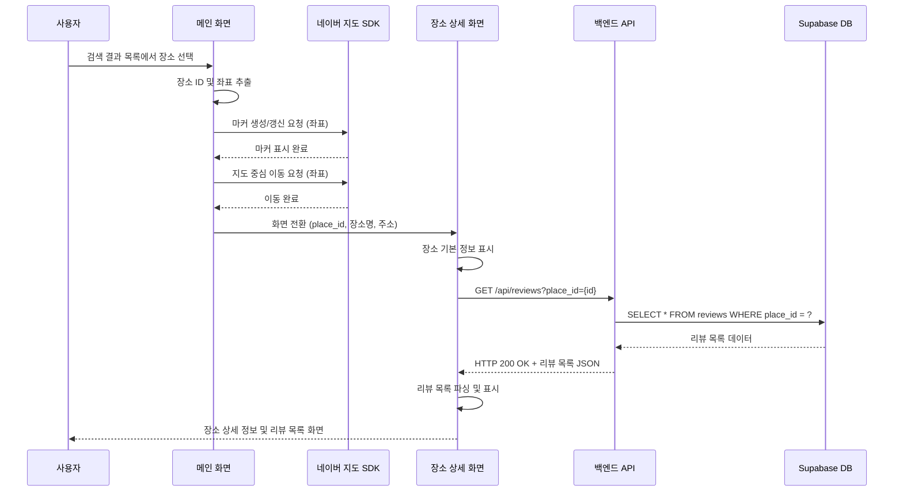

# 유스케이스 작성 문서

## 유스케이스 ID: UC-002

### 제목
검색 결과 선택 및 장소 상세 정보 조회 (Select Search Result & View Details)

---

## 1. 개요

### 1.1 목적
사용자가 장소 검색 결과 목록에서 특정 장소를 선택했을 때, 지도상에 해당 장소의 위치를 표시하고 장소의 상세 정보(기본 정보 및 기존 리뷰 목록)를 제공하여 방문 의사결정을 돕는다.

### 1.2 범위
- **포함 사항**:
  - 검색 결과 목록에서 장소 선택
  - 지도 마커 표시 및 지도 중심점 이동
  - 장소 상세 정보 화면 전환
  - 장소 기본 정보 표시 (이름, 주소 등)
  - 기존 리뷰 목록 조회 및 표시

- **제외 사항**:
  - 장소 검색 기능 자체 (UC-001에서 처리)
  - 리뷰 작성 기능 (UC-003에서 처리)
  - 장소 즐겨찾기, 공유 등 추가 기능

### 1.3 액터
- **주요 액터**: 일반 사용자 (앱을 이용하는 모든 사용자)
- **부 액터**:
  - 네이버 지도 SDK (지도 표시 및 마커 제어)
  - 백엔드 API 서버 (장소 상세 정보 및 리뷰 데이터 제공)
  - Supabase Database (리뷰 데이터 저장소)

---

## 2. 선행 조건

- 사용자가 장소 검색(UC-001)을 완료하고 검색 결과 목록이 화면에 표시되어 있어야 한다.
- 검색 결과 목록의 각 항목은 유효한 장소 ID와 좌표 정보를 포함하고 있어야 한다.
- 네이버 지도 SDK가 정상적으로 초기화되어 있어야 한다.
- 백엔드 API 서버와의 네트워크 연결이 가능한 상태여야 한다.

---

## 3. 참여 컴포넌트

- **메인 화면 (지도 화면)**: 검색 결과 목록 표시 및 사용자 입력 처리
- **네이버 지도 SDK**: 지도 표시, 마커 생성/갱신, 카메라 이동
- **장소 상세 정보 화면**: 선택된 장소의 상세 정보 및 리뷰 목록 표시
- **백엔드 API 서버**: 리뷰 데이터 조회 API 제공
- **Supabase Database**: `reviews` 테이블에서 `place_id` 기준으로 리뷰 데이터 조회

---

## 4. 기본 플로우 (Basic Flow)

### 4.1 단계별 흐름

1. **[사용자]**: 검색 결과 목록에서 특정 장소 항목을 탭
   - 입력: 장소 항목 선택 이벤트
   - 처리: UI 컴포넌트가 탭 이벤트를 감지
   - 출력: 선택된 항목의 데이터 (장소 ID, 좌표, 장소명 등)

2. **[메인 화면]**: 선택된 장소의 식별 정보 획득
   - 입력: 선택된 항목 데이터
   - 처리: 장소 ID (`place_id`)와 좌표 (`latitude`, `longitude`) 추출
   - 출력: 검증된 장소 식별 정보

3. **[네이버 지도 SDK]**: 지도에 마커 생성/갱신
   - 입력: 장소 좌표 (`latitude`, `longitude`)
   - 처리:
     - 기존 마커가 있으면 위치 갱신
     - 없으면 새 마커 생성 및 지도에 추가
   - 출력: 지도 상에 표시된 마커

4. **[네이버 지도 SDK]**: 지도 중심점 이동
   - 입력: 장소 좌표 및 애니메이션 설정
   - 처리: 지도 카메라를 해당 좌표로 부드럽게 이동 (smooth animation)
   - 출력: 선택된 장소가 지도 중심에 위치

5. **[메인 화면]**: 장소 상세 정보 화면으로 전환 준비
   - 입력: 장소 식별 정보 (`place_id`, 장소명, 주소 등)
   - 처리: 화면 전환을 위한 네비게이션 데이터 패킹
   - 출력: 네비게이션 파라미터

6. **[장소 상세 정보 화면]**: 화면 전환 및 데이터 로드
   - 입력: 전달받은 장소 식별 정보
   - 처리:
     - 장소 기본 정보 화면에 표시
     - 백엔드 API에 리뷰 목록 요청 (`GET /api/reviews?place_id={place_id}`)
   - 출력: 로딩 상태 표시

7. **[백엔드 API 서버]**: 리뷰 데이터 조회
   - 입력: `place_id` 파라미터
   - 처리:
     - Supabase Database에서 `SELECT * FROM reviews WHERE place_id = ? ORDER BY created_at DESC` 쿼리 실행
     - 조회된 리뷰 목록을 JSON 형태로 변환
   - 출력: HTTP 200 OK + 리뷰 목록 JSON 응답

8. **[장소 상세 정보 화면]**: 리뷰 목록 표시
   - 입력: API 응답 (리뷰 목록)
   - 처리:
     - 응답 데이터 파싱
     - 리뷰 목록 UI 컴포넌트에 바인딩
   - 출력: 화면에 표시된 리뷰 목록 (작성자, 평점, 내용, 작성일)

### 4.2 시퀀스 다이어그램

---

## 5. 대안 플로우 (Alternative Flows)

### 5.1 대안 플로우 1: 리뷰가 없는 장소

**시작 조건**: 백엔드 API에서 빈 리뷰 목록이 반환되는 경우

**단계**:
1. 백엔드 API가 HTTP 200 OK와 함께 빈 배열 `[]`을 응답
2. 장소 상세 정보 화면에서 빈 배열 확인
3. 리뷰 목록 영역에 "아직 리뷰가 없습니다. 첫 번째 리뷰를 작성해보세요!" 메시지 표시
4. "리뷰 작성하기" 버튼 강조 표시

**결과**: 사용자가 빈 상태를 명확히 인지하고 리뷰 작성을 유도받음

### 5.2 대안 플로우 2: 지도 마커가 이미 존재하는 경우

**시작 조건**: 이전에 선택한 장소의 마커가 지도에 이미 표시되어 있는 경우

**단계**:
1. 메인 화면이 기존 마커 존재 여부 확인
2. 기존 마커가 있으면 제거하거나 위치만 갱신
3. 새로운 좌표로 마커 위치 업데이트
4. 나머지 플로우는 기본 플로우와 동일

**결과**: 지도에 하나의 마커만 표시되며 중복 마커 생성 방지

---

## 6. 예외 플로우 (Exception Flows)

### 6.1 예외 상황 1: 장소 식별 정보 유효성 검증 실패

**발생 조건**: 선택된 항목의 `place_id` 또는 좌표가 `null`, `undefined`, 빈 문자열인 경우

**처리 방법**:
1. 메인 화면에서 데이터 검증 실패 감지
2. 화면 전환 중단
3. 사용자에게 토스트 메시지 표시: "장소 정보를 불러올 수 없습니다. 다시 시도해주세요."
4. 로그에 오류 기록 (디버깅 목적)

**에러 코드**: `CLIENT_ERROR_INVALID_PLACE_DATA` (클라이언트 측 검증 오류)

**사용자 메시지**: "장소 정보를 불러올 수 없습니다. 다시 시도해주세요."

### 6.2 예외 상황 2: 네트워크 오류로 리뷰 데이터 로드 실패

**발생 조건**:
- 백엔드 API 서버 응답 없음 (타임아웃)
- 네트워크 연결 끊김
- HTTP 5xx 서버 오류

**처리 방법**:
1. 장소 상세 정보 화면에서 API 요청 실패 감지
2. 로딩 상태 종료
3. 리뷰 목록 영역에 오류 메시지 표시: "리뷰를 불러오는 중 오류가 발생했습니다."
4. "다시 시도" 버튼 표시
5. 사용자가 "다시 시도" 버튼 클릭 시 리뷰 목록 재요청

**에러 코드**:
- `NETWORK_ERROR` (네트워크 오류)
- `HTTP_500` (서버 내부 오류)

**사용자 메시지**: "리뷰를 불러오는 중 오류가 발생했습니다. 다시 시도해주세요."

### 6.3 예외 상황 3: 네이버 지도 SDK 오류

**발생 조건**:
- 지도 SDK 초기화 실패
- 마커 생성/갱신 API 호출 실패
- 카메라 이동 실패

**처리 방법**:
1. 메인 화면에서 지도 SDK 오류 감지
2. 지도 관련 동작은 실패하지만 화면 전환은 진행
3. 사용자에게 토스트 메시지 표시: "지도를 표시하는 중 오류가 발생했습니다."
4. 장소 상세 정보 화면은 정상적으로 표시 (리뷰 목록은 로드)

**에러 코드**: `MAP_SDK_ERROR` (지도 SDK 오류)

**사용자 메시지**: "지도를 표시하는 중 오류가 발생했습니다."

### 6.4 예외 상황 4: API 응답 파싱 오류

**발생 조건**:
- 백엔드 API 응답 형식이 예상과 다름
- JSON 파싱 실패
- 필수 필드 누락

**처리 방법**:
1. 장소 상세 정보 화면에서 응답 파싱 실패 감지
2. 로딩 상태 종료
3. 리뷰 목록 영역에 오류 메시지 표시: "데이터 형식이 올바르지 않습니다."
4. 로그에 상세 오류 정보 기록 (디버깅 목적)

**에러 코드**: `DATA_PARSING_ERROR` (데이터 파싱 오류)

**사용자 메시지**: "데이터 형식이 올바르지 않습니다. 잠시 후 다시 시도해주세요."

---

## 7. 후행 조건 (Post-conditions)

### 7.1 성공 시

- **데이터베이스 변경**: 없음 (조회 작업만 수행)
- **시스템 상태**:
  - 장소 상세 정보 화면이 활성화됨
  - 지도에 선택된 장소의 마커가 표시됨
  - 지도 중심이 선택된 장소 위치로 이동됨
  - 해당 장소의 리뷰 목록이 화면에 표시됨
- **외부 시스템**:
  - 네이버 지도 SDK: 마커 및 카메라 상태 업데이트 완료
  - 백엔드 API: 리뷰 데이터 조회 완료

### 7.2 실패 시

- **데이터 롤백**: 해당 없음 (데이터 변경 작업 없음)
- **시스템 상태**:
  - **검증 실패 시**: 메인 화면에 머무르며 오류 피드백 표시
  - **네트워크 오류 시**: 장소 상세 정보 화면으로 전환되나 리뷰 목록 영역에 오류 상태 표시
  - **지도 오류 시**: 장소 상세 정보 화면 표시, 지도 마커/카메라 이동 생략

---

## 8. 비기능 요구사항

### 8.1 성능
- **지도 마커 표시**: 사용자 선택 후 500ms 이내에 마커가 지도에 표시되어야 함
- **화면 전환**: 사용자 선택 후 300ms 이내에 장소 상세 정보 화면으로 전환되어야 함
- **리뷰 목록 로드**: 백엔드 API 응답 시간 2초 이내 (네트워크 정상 상태 기준)
- **지도 애니메이션**: 지도 중심 이동 애니메이션은 1초 이내로 부드럽게 처리

### 8.2 보안
- **API 요청**: HTTPS 프로토콜 사용 필수
- **데이터 검증**: 클라이언트에서 전달되는 `place_id`는 서버 측에서도 재검증
- **SQL Injection 방지**: Supabase Prepared Statement 사용
- **개인정보 보호**: 리뷰 작성자 정보 중 민감 정보는 표시하지 않음 (이메일 마스킹 등)

### 8.3 가용성
- **오프라인 대응**: 네트워크 오류 발생 시 명확한 피드백 제공 및 재시도 옵션 제공
- **오류 복구**: 일시적 오류 발생 시 사용자가 쉽게 재시도할 수 있도록 UI 제공
- **로깅**: 모든 오류 상황은 로그에 기록하여 추후 분석 가능

---

## 9. UI/UX 요구사항

### 9.1 화면 구성

**메인 화면 (검색 결과 목록)**:
- 검색 결과 항목은 탭 가능한 카드 형태로 표시
- 각 항목에는 장소명, 주소, 썸네일 이미지(옵션) 포함
- 선택된 항목은 시각적 피드백 제공 (색상 변경, 애니메이션 등)

**장소 상세 정보 화면**:
- 상단: 장소명 (큰 글씨), 주소, 평균 평점 (별점)
- 중단: 지도 미리보기 (옵션, 작은 지도 또는 정적 이미지)
- 하단: 리뷰 목록 (스크롤 가능)
  - 각 리뷰: 작성자명, 별점, 내용, 작성일
  - "리뷰 작성하기" 버튼 (하단 고정 또는 플로팅 버튼)

**로딩 상태**:
- 리뷰 목록 로딩 시: 스켈레톤 UI 또는 스피너 표시
- 로딩 시간이 2초 이상 걸릴 경우 진행 상태 표시

**오류 상태**:
- 오류 메시지는 명확하고 간결하게 표시
- 오류 아이콘 및 "다시 시도" 버튼 포함

### 9.2 사용자 경험

- **즉각적인 피드백**: 사용자가 장소를 선택하면 즉시 시각적 피드백 제공 (탭 애니메이션)
- **부드러운 전환**: 화면 전환 및 지도 이동은 부드러운 애니메이션 적용
- **명확한 상태 표시**: 로딩, 성공, 오류 상태를 명확히 구분하여 표시
- **재시도 용이성**: 오류 발생 시 사용자가 쉽게 재시도할 수 있도록 버튼 제공
- **정보 계층**: 장소의 핵심 정보(이름, 주소, 평점)를 먼저 표시하고 리뷰는 스크롤하여 확인

---

## 10. 테스트 시나리오

### 10.1 성공 케이스

| 테스트 케이스 ID | 입력값 | 기대 결과 |
|----------------|--------|----------|
| TC-002-01      | 검색 결과에서 "이차돌 신설동점" 선택 | 지도에 마커 표시, 지도 중심 이동, 장소 상세 화면 전환, 리뷰 목록 표시 |
| TC-002-02      | 리뷰가 있는 장소 선택 | 리뷰 목록이 최신순으로 정렬되어 표시 |
| TC-002-03      | 리뷰가 없는 장소 선택 | "아직 리뷰가 없습니다" 메시지 표시, "리뷰 작성하기" 버튼 강조 |
| TC-002-04      | 이미 마커가 있는 상태에서 다른 장소 선택 | 기존 마커 제거/갱신, 새 마커 표시, 지도 이동 |

### 10.2 실패 케이스

| 테스트 케이스 ID | 입력값 | 기대 결과 |
|----------------|--------|----------|
| TC-002-05      | `place_id`가 `null`인 항목 선택 | 화면 전환 없음, "장소 정보를 불러올 수 없습니다" 토스트 표시 |
| TC-002-06      | 좌표가 유효하지 않은 항목 선택 | 화면 전환 없음, 오류 메시지 표시 |
| TC-002-07      | 네트워크 오프라인 상태에서 장소 선택 | 장소 기본 정보는 표시, 리뷰 목록 영역에 "네트워크 오류" 메시지 및 "다시 시도" 버튼 표시 |
| TC-002-08      | 백엔드 API 5xx 오류 발생 | 리뷰 목록 영역에 "서버 오류" 메시지 표시, "다시 시도" 버튼 제공 |
| TC-002-09      | API 응답 JSON 형식 오류 | 리뷰 목록 영역에 "데이터 형식 오류" 메시지 표시 |
| TC-002-10      | 지도 SDK 마커 생성 실패 | 화면 전환은 진행, "지도 표시 오류" 토스트 표시, 리뷰 목록은 정상 로드 |

---

## 11. 관련 유스케이스

- **선행 유스케이스**: UC-001 (장소 검색) - 검색 결과 목록이 표시되어 있어야 함
- **후행 유스케이스**: UC-003 (리뷰 작성) - 장소 상세 화면에서 "리뷰 작성하기" 버튼 클릭 시 실행
- **연관 유스케이스**:
  - UC-004 (리뷰 수정/삭제) - 작성된 리뷰를 수정하거나 삭제하는 기능
  - UC-005 (장소 즐겨찾기) - 장소를 즐겨찾기에 추가하는 기능 (미래 기능)

---

## 12. 변경 이력

| 버전 | 날짜 | 작성자 | 변경 내용 |
|------|------|--------|-----------|
| 1.0  | 2025-10-23 | Claude Code | 초기 작성 |

---

## 부록

### A. 용어 정의

- **place_id**: 장소를 고유하게 식별하는 ID (네이버 API에서 제공하는 값 또는 자체 생성 값)
- **마커 (Marker)**: 지도 위에 표시되는 위치 표시 아이콘
- **카메라 이동 (Camera Move)**: 지도의 중심점 및 줌 레벨을 변경하는 동작
- **토스트 메시지 (Toast Message)**: 화면 하단에 잠시 표시되는 간단한 알림 메시지
- **스켈레톤 UI (Skeleton UI)**: 데이터 로딩 중 콘텐츠의 구조를 미리 보여주는 플레이스홀더 UI

### B. 참고 자료

- [네이버 지도 SDK 문서](https://navermaps.github.io/android-map-sdk/guide-ko/)
- [Supabase 문서](https://supabase.com/docs)
- [프로젝트 PRD 문서](../prd.md)
- [프로젝트 유저플로우 문서](../userflow.md)
- [프로젝트 데이터베이스 문서](../database.md)
