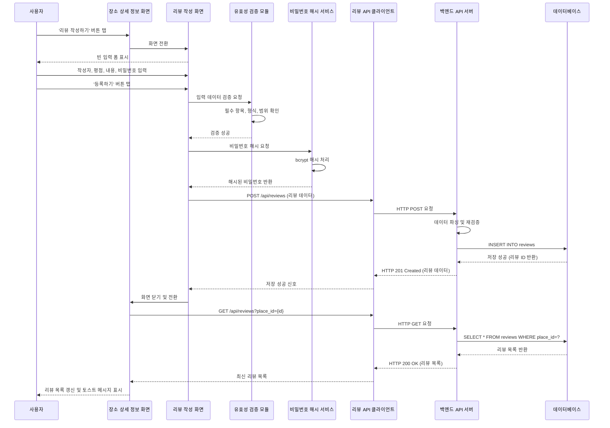

# 유스케이스 작성 템플릿

## 유스케이스 ID: UC-003

### 제목
리뷰 작성 (Write a Review)

---

## 1. 개요

### 1.1 목적
사용자가 방문했던 장소에 대한 경험을 평점과 텍스트 리뷰로 작성하여 다른 사용자들과 공유함으로써, 장소 정보의 신뢰도와 가치를 높이는 것을 목표로 합니다.

### 1.2 범위
- **포함 사항**:
  - 장소 상세 정보 화면에서 리뷰 작성 화면으로의 전환
  - 작성자 정보(닉네임/이메일), 평점, 리뷰 내용, 비밀번호 입력
  - 입력 데이터 유효성 검증 (필수 항목, 글자 수 제한 등)
  - 비밀번호 해시 처리 및 데이터베이스 저장
  - 리뷰 등록 성공 시 장소 상세 정보 화면으로 자동 전환 및 목록 갱신

- **제외 사항**:
  - 사용자 회원가입 및 로그인 기능
  - 리뷰 수정 및 삭제 기능 (별도 유스케이스로 분리)
  - 리뷰에 이미지 첨부 기능
  - 리뷰 신고 및 관리 기능

### 1.3 액터
- **주요 액터**: 일반 사용자 (앱을 사용하여 장소를 방문하고 리뷰를 작성하는 사람)
- **부 액터**:
  - 데이터베이스 시스템 (리뷰 데이터 저장 및 조회)
  - 비밀번호 해시 서비스 (보안 처리)

---

## 2. 선행 조건

- 사용자가 앱을 실행하고 있어야 합니다.
- 사용자가 장소 검색을 통해 특정 장소를 선택하여 '장소 상세 정보 화면'에 진입한 상태여야 합니다.
- 데이터베이스의 `reviews` 테이블이 정상적으로 작동하고 있어야 합니다.
- 네트워크 연결이 가능한 상태여야 합니다.

---

## 3. 참여 컴포넌트

- **장소 상세 정보 화면 (PlaceDetailScreen)**: 리뷰 작성 버튼 제공 및 리뷰 목록 갱신
- **리뷰 작성 화면 (WriteReviewScreen)**: 사용자 입력을 받는 폼(Form) 인터페이스
- **리뷰 입력 폼 컴포넌트 (ReviewForm)**: 작성자, 평점, 내용, 비밀번호 입력 필드 관리
- **유효성 검증 모듈 (ValidationService)**: 입력 데이터의 규칙 검증
- **비밀번호 해시 서비스 (PasswordHashService)**: 비밀번호 암호화 처리
- **리뷰 API 클라이언트 (ReviewApiClient)**: 백엔드 API 호출 및 응답 처리
- **백엔드 API 서버 (Backend API)**: 리뷰 데이터 저장 로직 및 데이터베이스 연동
- **데이터베이스 (PostgreSQL)**: `reviews` 테이블에 데이터 저장

---

## 4. 기본 플로우 (Basic Flow)

### 4.1 단계별 흐름

1. **[사용자]**: 장소 상세 정보 화면에서 '리뷰 작성하기' 버튼을 탭합니다.
   - 입력: 버튼 탭 이벤트
   - 처리: 화면 전환 이벤트 트리거
   - 출력: 리뷰 작성 화면으로 네비게이션

2. **[리뷰 작성 화면]**: 빈 입력 폼이 표시됩니다.
   - 입력: 없음
   - 처리: 입력 필드 초기화 (작성자, 평점, 내용, 비밀번호)
   - 출력: 사용자가 입력할 수 있는 준비 완료된 폼

3. **[사용자]**: 각 입력 필드에 정보를 기입합니다.
   - 입력: 작성자 정보 (닉네임 또는 이메일), 평점 (1~5점), 리뷰 내용 (텍스트), 비밀번호 (4자리 숫자)
   - 처리: 입력된 데이터를 폼 상태(state)에 저장
   - 출력: 실시간 입력 피드백 (글자 수 표시 등)

4. **[사용자]**: 모든 정보 입력 후 '등록하기' 버튼을 탭합니다.
   - 입력: 등록하기 버튼 탭 이벤트
   - 처리: 폼 제출 이벤트 트리거
   - 출력: 다음 단계로 진행

5. **[유효성 검증 모듈]**: 모든 입력 필드의 데이터를 가져와 검증을 수행합니다.
   - 입력: 작성자, 평점, 리뷰 내용, 비밀번호 데이터
   - 처리:
     - 필수 항목 누락 여부 확인
     - 작성자 정보 형식 검증 (이메일 형식 등)
     - 평점이 1~5 범위인지 확인
     - 리뷰 내용이 최소 10자, 최대 1000자 이내인지 확인
     - 비밀번호가 4자리 숫자인지 확인
   - 출력: 검증 결과 (성공 또는 오류 목록)

6. **[비밀번호 해시 서비스]**: 검증 통과 시, 비밀번호를 해시 처리합니다.
   - 입력: 평문 비밀번호
   - 처리: bcrypt 또는 SHA-256 등의 해시 알고리즘 적용
   - 출력: 해시된 비밀번호 문자열

7. **[리뷰 API 클라이언트]**: 리뷰 데이터 객체를 생성하고 백엔드 API로 전송합니다.
   - 입력:
     - `place_id` (현재 장소의 고유 ID)
     - `author_nickname` (작성자 정보)
     - `rating` (평점)
     - `content` (리뷰 내용)
     - `password_hash` (해시된 비밀번호)
   - 처리: POST `/api/reviews` 요청 전송
   - 출력: API 응답 대기

8. **[백엔드 API 서버]**: 요청을 받아 데이터베이스에 저장합니다.
   - 입력: 리뷰 데이터 객체 (JSON)
   - 처리:
     - 요청 데이터 파싱 및 재검증
     - `reviews` 테이블에 INSERT 쿼리 실행
     - `created_at` 타임스탬프 자동 생성
   - 출력: 저장 성공 응답 (HTTP 201 Created) 및 생성된 리뷰 ID 반환

9. **[리뷰 API 클라이언트]**: 성공 응답을 받아 처리합니다.
   - 입력: HTTP 201 응답 및 리뷰 데이터
   - 처리: 응답 데이터 파싱 및 성공 상태 확인
   - 출력: 성공 신호를 리뷰 작성 화면에 전달

10. **[리뷰 작성 화면]**: 성공 신호를 받아 화면을 닫습니다.
    - 입력: 성공 신호
    - 처리: 현재 화면 닫기 및 이전 화면으로 네비게이션
    - 출력: 장소 상세 정보 화면으로 전환

11. **[장소 상세 정보 화면]**: 리뷰 목록을 새로고침하여 방금 작성된 리뷰를 표시합니다.
    - 입력: 화면 재진입 이벤트
    - 처리: GET `/api/reviews?place_id={id}` 요청으로 최신 리뷰 목록 재조회
    - 출력:
      - 방금 작성된 리뷰가 목록 최상단에 표시됨
      - "리뷰가 성공적으로 등록되었습니다" 토스트 메시지 표시

### 4.2 시퀀스 다이어그램

---

## 5. 대안 플로우 (Alternative Flows)

### 5.1 대안 플로우 1: 작성 중 화면 이탈

**시작 조건**: 사용자가 리뷰 내용을 입력하는 중에 뒤로가기 버튼이나 화면 밖 영역을 탭하여 화면을 닫으려고 시도

**단계**:
1. 시스템이 화면 닫기 이벤트를 감지합니다.
2. 입력된 데이터가 있는지 확인합니다.
3. 데이터가 있을 경우, "작성 중인 리뷰를 삭제하시겠습니까?" 확인 다이얼로그를 표시합니다.
4. 사용자가 '예'를 선택하면 입력 데이터를 폐기하고 이전 화면으로 전환합니다.
5. 사용자가 '아니오'를 선택하면 리뷰 작성 화면에 머무릅니다.

**결과**: 사용자의 의도하지 않은 데이터 손실을 방지합니다.

### 5.2 대안 플로우 2: 네트워크 불안정 시 재시도

**시작 조건**: API 요청 중 네트워크 연결이 일시적으로 불안정하여 타임아웃이 발생

**단계**:
1. API 클라이언트가 타임아웃 오류를 감지합니다.
2. 자동으로 최대 3회까지 재시도를 수행합니다. (Exponential Backoff 방식: 1초, 2초, 4초 대기)
3. 재시도가 성공하면 기본 플로우의 9단계로 진행합니다.
4. 3회 재시도 후에도 실패하면 예외 플로우 6.1로 진행합니다.

**결과**: 일시적인 네트워크 불안정으로 인한 실패를 자동으로 복구합니다.

---

## 6. 예외 플로우 (Exception Flows)

### 6.1 예외 상황 1: 필수 입력 항목 누락

**발생 조건**: 사용자가 작성자, 평점, 리뷰 내용, 비밀번호 중 하나라도 입력하지 않고 '등록하기' 버튼을 탭한 경우

**처리 방법**:
1. 유효성 검증 모듈이 누락된 필드를 감지합니다.
2. 누락된 필드 목록을 반환합니다.
3. 리뷰 작성 화면에서 누락된 필드 하단에 빨간색 경고 메시지를 표시합니다.
   - 예: "작성자 정보를 입력해주세요."
4. 해당 필드로 자동 포커스를 이동합니다.
5. 사용자가 수정할 때까지 '등록하기' 버튼은 비활성화되지 않으나, 동일 오류가 반복될 수 있습니다.

**에러 코드**: `VALIDATION_ERROR_REQUIRED_FIELD` (클라이언트 측 오류, HTTP 요청 전)

**사용자 메시지**: "[필드명]을(를) 입력해주세요."

### 6.2 예외 상황 2: 리뷰 내용 글자 수 제한 초과

**발생 조건**: 사용자가 리뷰 내용을 10자 미만 또는 1000자 초과로 입력한 경우

**처리 방법**:
1. 유효성 검증 모듈이 글자 수를 체크합니다.
2. 조건 미충족 시 오류 메시지를 반환합니다.
3. 리뷰 내용 입력 필드 하단에 경고 메시지를 표시합니다.
   - 예: "리뷰는 최소 10자 이상, 최대 1000자 이하로 작성해주세요. (현재: 5자)"
4. 실시간으로 글자 수를 카운팅하여 표시합니다.

**에러 코드**: `VALIDATION_ERROR_CONTENT_LENGTH` (클라이언트 측 오류)

**사용자 메시지**: "리뷰는 최소 10자 이상, 최대 1000자 이하로 작성해주세요."

### 6.3 예외 상황 3: 평점 미선택

**발생 조건**: 사용자가 별점을 선택하지 않고 '등록하기' 버튼을 탭한 경우

**처리 방법**:
1. 유효성 검증 모듈이 평점이 null 또는 0인지 확인합니다.
2. 평점 선택 UI 영역을 강조 표시합니다. (빨간색 테두리 등)
3. "평점을 선택해주세요." 메시지를 표시합니다.

**에러 코드**: `VALIDATION_ERROR_RATING_REQUIRED`

**사용자 메시지**: "평점을 선택해주세요."

### 6.4 예외 상황 4: 비밀번호 형식 오류

**발생 조건**: 사용자가 4자리 숫자가 아닌 비밀번호를 입력한 경우

**처리 방법**:
1. 유효성 검증 모듈이 비밀번호 형식을 체크합니다. (정규식: `^\d{4}$`)
2. 조건 미충족 시 비밀번호 입력 필드 하단에 경고 메시지를 표시합니다.
3. "비밀번호는 4자리 숫자로 입력해주세요." 메시지를 표시합니다.

**에러 코드**: `VALIDATION_ERROR_PASSWORD_FORMAT`

**사용자 메시지**: "비밀번호는 4자리 숫자로 입력해주세요."

### 6.5 예외 상황 5: 네트워크 연결 오류

**발생 조건**: API 요청 중 네트워크가 완전히 끊어지거나, 서버에 연결할 수 없는 경우

**처리 방법**:
1. API 클라이언트가 네트워크 오류를 감지합니다.
2. 최대 3회 재시도를 수행합니다. (대안 플로우 5.2 참조)
3. 3회 재시도 후에도 실패 시, 리뷰 작성 화면에 머무릅니다.
4. "네트워크 연결을 확인하고 다시 시도해주세요." 메시지를 표시합니다.
5. 입력했던 데이터는 보존됩니다. (사용자가 다시 시도할 수 있도록)

**에러 코드**: `NETWORK_ERROR` (HTTP 상태 코드 없음)

**사용자 메시지**: "네트워크 연결을 확인하고 다시 시도해주세요."

### 6.6 예외 상황 6: 데이터베이스 저장 실패

**발생 조건**: 백엔드 API 서버에서 데이터베이스 저장 중 오류 발생 (DB 서버 다운, 트랜잭션 실패 등)

**처리 방법**:
1. 백엔드 API 서버가 데이터베이스 오류를 감지합니다.
2. HTTP 500 Internal Server Error 응답을 반환합니다.
3. API 클라이언트가 500 오류를 받아 처리합니다.
4. 리뷰 작성 화면에 "서버 오류로 리뷰를 등록하지 못했습니다. 잠시 후 다시 시도해주세요." 메시지를 표시합니다.
5. 입력했던 데이터는 보존됩니다.

**에러 코드**: `DATABASE_ERROR` (HTTP 500)

**사용자 메시지**: "서버 오류로 리뷰를 등록하지 못했습니다. 잠시 후 다시 시도해주세요."

### 6.7 예외 상황 7: 중복 리뷰 방지 (선택적)

**발생 조건**: 동일한 장소에 대해 동일한 작성자가 짧은 시간 내에 여러 리뷰를 작성하려는 경우 (스팸 방지)

**처리 방법**:
1. 백엔드 API 서버가 최근 5분 이내에 동일 작성자(닉네임/이메일 기준)가 해당 장소에 리뷰를 남긴 이력을 확인합니다.
2. 중복 감지 시 HTTP 429 Too Many Requests 응답을 반환합니다.
3. API 클라이언트가 429 오류를 받아 처리합니다.
4. "이미 이 장소에 리뷰를 작성하셨습니다. 잠시 후 다시 시도해주세요." 메시지를 표시합니다.

**에러 코드**: `DUPLICATE_REVIEW_ERROR` (HTTP 429)

**사용자 메시지**: "이미 이 장소에 리뷰를 작성하셨습니다. 잠시 후 다시 시도해주세요."

---

## 7. 후행 조건 (Post-conditions)

### 7.1 성공 시

**데이터베이스 변경**:
- `reviews` 테이블에 새로운 레코드가 추가됩니다.
  - `id`: 자동 생성된 고유 리뷰 ID (BIGSERIAL)
  - `place_id`: 리뷰가 작성된 장소의 고유 ID
  - `author_nickname`: 사용자가 입력한 작성자 정보
  - `rating`: 사용자가 선택한 평점 (1~5)
  - `content`: 사용자가 작성한 리뷰 내용
  - `password_hash`: 해시된 비밀번호
  - `created_at`: 현재 타임스탬프 (자동 생성)
  - `updated_at`: NULL (초기 생성 시)

**시스템 상태**:
- 리뷰 작성 화면이 닫히고 장소 상세 정보 화면으로 전환됩니다.
- 장소 상세 정보 화면의 리뷰 목록이 최신 데이터로 갱신됩니다.
- 방금 작성된 리뷰가 리뷰 목록의 최상단에 표시됩니다.
- 평균 평점이 재계산되어 화면에 반영됩니다.

**외부 시스템**:
- 없음 (현재 유스케이스는 외부 API 연동 없음)

### 7.2 실패 시

**데이터 롤백**:
- 유효성 검증 실패 시: 데이터베이스에 변경 사항이 없습니다.
- 네트워크 오류 시: 데이터베이스에 변경 사항이 없습니다.
- 데이터베이스 저장 실패 시: 트랜잭션 롤백이 발생하여 데이터베이스에 변경 사항이 없습니다.

**시스템 상태**:
- 리뷰 작성 화면에 머무릅니다.
- 사용자가 입력했던 데이터는 보존됩니다. (네트워크 오류 또는 서버 오류 시)
- 장소 상세 정보 화면의 리뷰 목록은 변경되지 않습니다.

---

## 8. 비기능 요구사항

### 8.1 성능

- **응답 시간**: 리뷰 등록 API 요청부터 응답까지 평균 2초 이내, 최대 5초 이내
- **동시 처리**: 최소 100명의 사용자가 동시에 리뷰를 작성할 수 있어야 함
- **데이터베이스 쿼리**: INSERT 쿼리 실행 시간 100ms 이내
- **UI 반응성**: 사용자 입력 시 즉각적인 피드백 제공 (50ms 이내)

### 8.2 보안

- **비밀번호 보호**:
  - 비밀번호는 절대 평문으로 저장하지 않음
  - bcrypt 해시 알고리즘 사용 (비용 계수 10 이상)
  - 비밀번호는 네트워크 전송 시 HTTPS를 통해서만 전송
- **입력 검증**:
  - 클라이언트 측과 서버 측 모두에서 이중 검증 수행
  - SQL Injection 방지를 위한 파라미터화된 쿼리 사용
  - XSS 방지를 위한 입력 데이터 이스케이프 처리
- **Rate Limiting**:
  - IP 기준 분당 최대 5회 리뷰 작성 요청 제한
  - 동일 작성자 기준 5분 내 동일 장소에 대한 중복 리뷰 방지

### 8.3 가용성

- **서비스 가동률**: 99.9% 이상 (월 최대 43분 다운타임 허용)
- **에러 처리**: 모든 예외 상황에 대해 명확한 사용자 피드백 제공
- **데이터 복구**: 데이터베이스 백업을 통해 최대 1시간 이내의 데이터 복구 가능

### 8.4 확장성

- **데이터 증가 대응**: `reviews` 테이블에 100만 건의 레코드가 저장되어도 성능 저하 없이 조회 가능 (인덱스 활용)
- **트래픽 증가 대응**: 수평 확장(Scale-out)을 통해 서버 인스턴스 추가 가능

---

## 9. UI/UX 요구사항

### 9.1 화면 구성

**리뷰 작성 화면 (WriteReviewScreen)**:

1. **헤더 영역**:
   - 제목: "리뷰 작성"
   - 뒤로가기 버튼 (왼쪽 상단)
   - 닫기 버튼 (오른쪽 상단)

2. **입력 폼 영역**:
   - **작성자 정보 입력 필드**:
     - 레이블: "작성자 (닉네임 또는 이메일)"
     - 플레이스홀더: "예: hong@example.com"
     - 타입: 텍스트 입력 (Text Input)
     - 필수 표시: 빨간색 별표 (*)

   - **평점 선택 UI**:
     - 레이블: "평점"
     - UI 타입: 별점 선택 (Star Rating) - 1~5점
     - 초기값: 0점 (선택되지 않음)
     - 필수 표시: 빨간색 별표 (*)

   - **리뷰 내용 입력 필드**:
     - 레이블: "리뷰 내용"
     - 플레이스홀더: "이 장소에 대한 솔직한 리뷰를 작성해주세요. (최소 10자, 최대 1000자)"
     - 타입: 다중 라인 텍스트 입력 (Text Area)
     - 높이: 최소 5줄
     - 실시간 글자 수 표시: "현재: 0자 / 1000자"
     - 필수 표시: 빨간색 별표 (*)

   - **비밀번호 입력 필드**:
     - 레이블: "비밀번호 (리뷰 수정/삭제 시 사용)"
     - 플레이스홀더: "4자리 숫자를 입력하세요"
     - 타입: 숫자 키패드 입력 (Numeric Input)
     - 마스킹: 입력값을 ••••로 표시
     - 필수 표시: 빨간색 별표 (*)
     - 안내 문구: "입력하신 비밀번호는 리뷰 수정 및 삭제 시 사용됩니다."

3. **버튼 영역** (화면 하단 고정):
   - **등록하기 버튼**:
     - 스타일: 전체 너비, 강조 색상 (Primary Color)
     - 텍스트: "등록하기"
     - 로딩 상태: API 요청 중 스피너 표시 및 버튼 비활성화

4. **오류 메시지 영역**:
   - 각 입력 필드 하단에 동적으로 표시
   - 스타일: 빨간색 텍스트, 작은 폰트
   - 예: "작성자 정보를 입력해주세요."

### 9.2 사용자 경험

**입력 편의성**:
- 자동 포커스: 화면 진입 시 첫 번째 입력 필드(작성자 정보)에 자동 포커스
- 키보드 타입: 각 입력 필드에 맞는 키보드 자동 표시 (이메일, 숫자 등)
- 실시간 피드백: 리뷰 내용 입력 시 글자 수를 실시간으로 카운팅하여 표시

**오류 처리**:
- 필드별 오류: 특정 필드에 오류가 있을 경우 해당 필드만 강조 표시
- 자동 스크롤: 오류가 발생한 필드로 자동 스크롤
- 명확한 메시지: 사용자가 무엇을 수정해야 하는지 명확히 안내

**성공 피드백**:
- 토스트 메시지: "리뷰가 성공적으로 등록되었습니다" (3초간 표시)
- 햅틱 피드백: 성공 시 진동 피드백 제공 (모바일)
- 즉각적인 반영: 장소 상세 정보 화면으로 전환 후 방금 작성한 리뷰가 목록 최상단에 즉시 표시

**작성 중 이탈 방지**:
- 데이터 입력 후 뒤로가기 또는 닫기 시 확인 다이얼로그 표시
- "작성 중인 리뷰를 삭제하시겠습니까?" 메시지와 함께 '예' / '아니오' 선택지 제공

**접근성 (Accessibility)**:
- 모든 입력 필드에 적절한 레이블 및 ARIA 속성 제공
- 키보드 네비게이션 지원 (Tab 키로 필드 간 이동)
- 스크린 리더 호환성 확보

---

## 10. 테스트 시나리오

### 10.1 성공 케이스

| 테스트 케이스 ID | 입력값 | 기대 결과 |
|----------------|--------|----------|
| TC-WR-01      | 작성자: "hong@example.com" 평점: 5점 내용: "정말 맛있었어요. 강력 추천합니다!" 비밀번호: "1234" | HTTP 201 Created 응답 데이터베이스에 리뷰 저장 장소 상세 정보 화면으로 전환 리뷰 목록 최상단에 방금 작성한 리뷰 표시 토스트 메시지 표시 |
| TC-WR-02      | 작성자: "김나영" 평점: 4점 내용: "분위기 좋고 음식도 괜찮았어요. 다만 가격이 조금 비싼 편입니다." 비밀번호: "9876" | 동일한 성공 프로세스 |
| TC-WR-03      | 작성자: "tester" 평점: 3점 내용: "보통이에요." (10자 정확히) 비밀번호: "0000" | 최소 글자 수 조건 충족하여 정상 등록 |
| TC-WR-04      | 작성자: "reviewer" 평점: 1점 내용: (1000자 정확히) 비밀번호: "5555" | 최대 글자 수 조건 충족하여 정상 등록 |

### 10.2 실패 케이스

| 테스트 케이스 ID | 입력값 | 기대 결과 |
|----------------|--------|----------|
| TC-WR-05      | 작성자: (빈 값) 평점: 5점 내용: "좋아요" 비밀번호: "1234" | "작성자 정보를 입력해주세요." 오류 메시지 표시 작성자 필드에 포커스 이동 |
| TC-WR-06      | 작성자: "hong" 평점: (선택 안 함) 내용: "좋아요" 비밀번호: "1234" | "평점을 선택해주세요." 오류 메시지 표시 평점 UI 강조 표시 |
| TC-WR-07      | 작성자: "hong" 평점: 5점 내용: "좋아요" (3자) 비밀번호: "1234" | "리뷰는 최소 10자 이상, 최대 1000자 이하로 작성해주세요. (현재: 3자)" 오류 메시지 표시 |
| TC-WR-08      | 작성자: "hong" 평점: 5점 내용: (1001자) 비밀번호: "1234" | "리뷰는 최소 10자 이상, 최대 1000자 이하로 작성해주세요. (현재: 1001자)" 오류 메시지 표시 |
| TC-WR-09      | 작성자: "hong" 평점: 5점 내용: "좋아요 정말 좋았어요" 비밀번호: (빈 값) | "비밀번호를 입력해주세요." 오류 메시지 표시 |
| TC-WR-10      | 작성자: "hong" 평점: 5점 내용: "좋아요 정말 좋았어요" 비밀번호: "12" (2자리) | "비밀번호는 4자리 숫자로 입력해주세요." 오류 메시지 표시 |
| TC-WR-11      | 작성자: "hong" 평점: 5점 내용: "좋아요 정말 좋았어요" 비밀번호: "abcd" (문자) | "비밀번호는 4자리 숫자로 입력해주세요." 오류 메시지 표시 |
| TC-WR-12      | (정상 입력) 네트워크 연결 끊김 상태 | "네트워크 연결을 확인하고 다시 시도해주세요." 오류 메시지 표시 입력 데이터 보존 |
| TC-WR-13      | (정상 입력) 데이터베이스 서버 다운 상태 | HTTP 500 오류 발생 "서버 오류로 리뷰를 등록하지 못했습니다. 잠시 후 다시 시도해주세요." 메시지 표시 입력 데이터 보존 |
| TC-WR-14      | 동일 작성자가 5분 이내에 동일 장소에 재작성 시도 | HTTP 429 오류 발생 "이미 이 장소에 리뷰를 작성하셨습니다. 잠시 후 다시 시도해주세요." 메시지 표시 |

### 10.3 경계값 테스트

| 테스트 케이스 ID | 입력값 | 기대 결과 |
|----------------|--------|----------|
| TC-WR-15      | 리뷰 내용: (정확히 10자) | 정상 등록 (최소 글자 수 경계값) |
| TC-WR-16      | 리뷰 내용: (9자) | 오류 메시지 표시 (최소 글자 수 미달) |
| TC-WR-17      | 리뷰 내용: (정확히 1000자) | 정상 등록 (최대 글자 수 경계값) |
| TC-WR-18      | 리뷰 내용: (1001자) | 오류 메시지 표시 (최대 글자 수 초과) |
| TC-WR-19      | 평점: 1점 | 정상 등록 (최소 평점) |
| TC-WR-20      | 평점: 5점 | 정상 등록 (최대 평점) |

---

## 11. 관련 유스케이스

- **선행 유스케이스**:
  - UC-001: 장소 검색 (Place Search) - 사용자가 리뷰를 작성할 장소를 먼저 검색해야 함
  - UC-002: 검색 결과 선택 및 상세 정보 조회 - 장소 상세 정보 화면에 진입해야 리뷰 작성 버튼을 사용할 수 있음

- **후행 유스케이스**:
  - UC-004: 리뷰 수정 (Edit Review) - 작성된 리뷰를 수정하는 기능
  - UC-005: 리뷰 삭제 (Delete Review) - 작성된 리뷰를 삭제하는 기능

- **연관 유스케이스**:
  - UC-006: 리뷰 목록 조회 (View Review List) - 장소 상세 정보 화면에서 다른 사용자들의 리뷰를 조회하는 기능

---

## 12. 변경 이력

| 버전 | 날짜 | 작성자 | 변경 내용 |
|------|------|--------|-----------|
| 1.0  | 2025-10-23 | Claude AI | 초기 작성 |

---

## 부록

### A. 용어 정의

- **리뷰 (Review)**: 사용자가 특정 장소를 방문한 후 남기는 평가 및 의견
- **평점 (Rating)**: 1점에서 5점까지의 별점으로 표현되는 만족도 점수
- **place_id**: 네이버 지도 API에서 제공하는 장소의 고유 식별자
- **해시 (Hash)**: 비밀번호를 암호화하여 원본을 알 수 없게 만드는 단방향 암호화 기법
- **bcrypt**: 비밀번호 해시 생성에 널리 사용되는 해시 알고리즘
- **토스트 메시지 (Toast Message)**: 화면 하단에 잠시 표시되는 간단한 알림 메시지
- **Exponential Backoff**: 재시도 시 대기 시간을 지수적으로 증가시키는 전략 (1초, 2초, 4초 등)

### B. 참고 자료

- **관련 문서**:
  - `requirement.md`: 프로젝트 요구사항 정의서
  - `prd.md`: 제품 요구사항 문서
  - `userflow.md`: 사용자 플로우 상세 문서
  - `database.md`: 데이터베이스 스키마 및 데이터플로우 문서

- **API 명세**:
  - POST `/api/reviews`: 리뷰 생성 API
  - GET `/api/reviews?place_id={id}`: 특정 장소의 리뷰 목록 조회 API

- **외부 링크**:
  - [bcrypt 해시 알고리즘 소개](https://en.wikipedia.org/wiki/Bcrypt)
  - [REST API 설계 가이드](https://restfulapi.net/)
  - [WCAG 2.1 접근성 가이드라인](https://www.w3.org/WAI/WCAG21/quickref/)

- **기술 스택**:
  - 프론트엔드: React, Next.js, TypeScript
  - 백엔드: Hono (Node.js 기반 웹 프레임워크)
  - 데이터베이스: PostgreSQL (Supabase)
  - 상태 관리: React Query, Zustand
  - 폼 관리: React Hook Form
  - 유효성 검증: Zod
